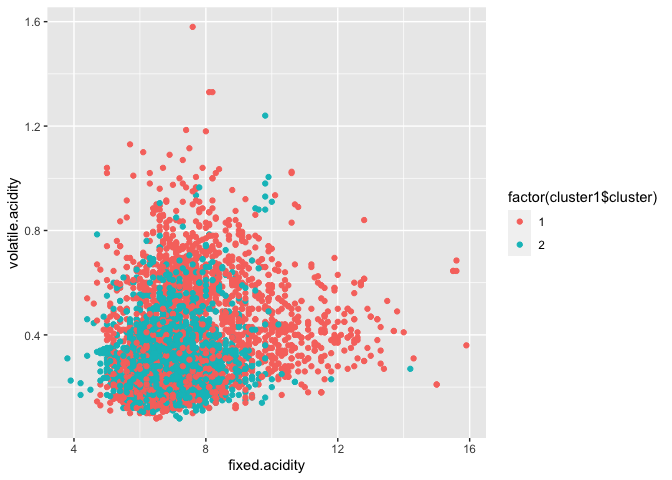
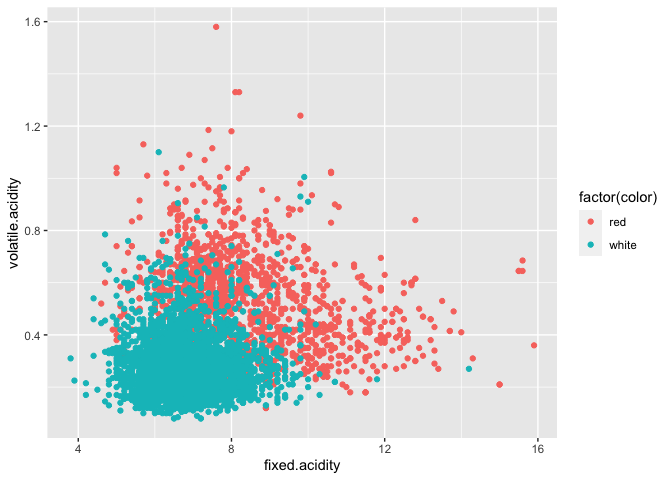
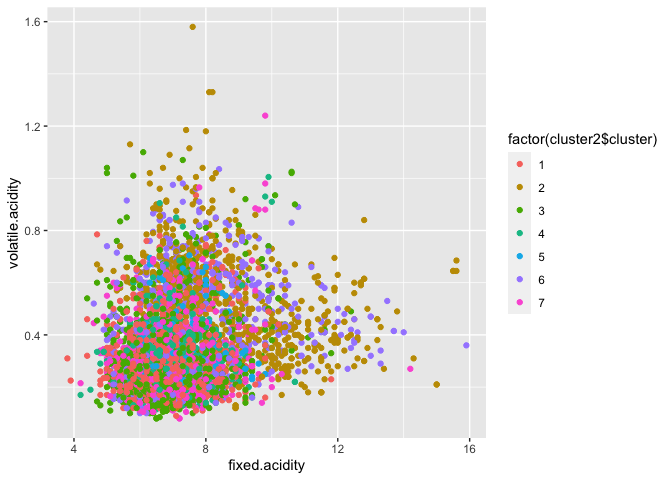
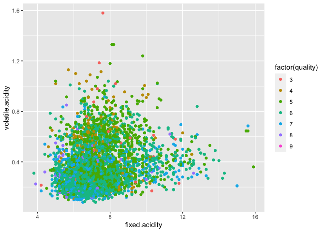
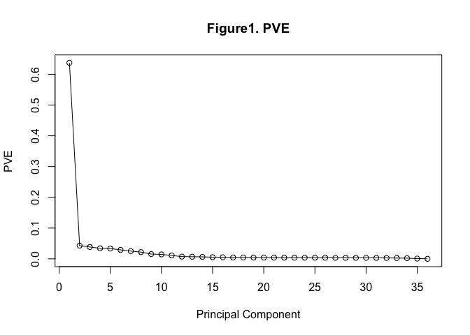
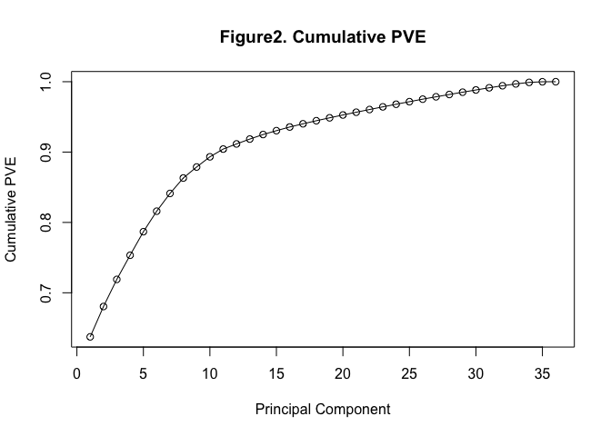
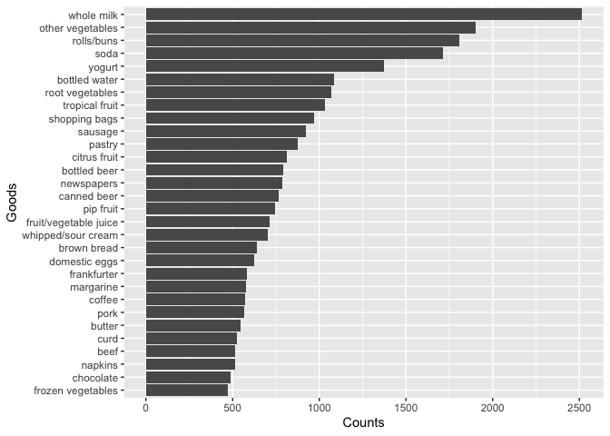
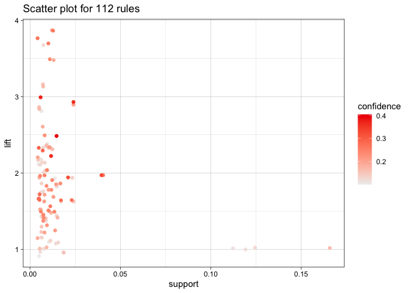
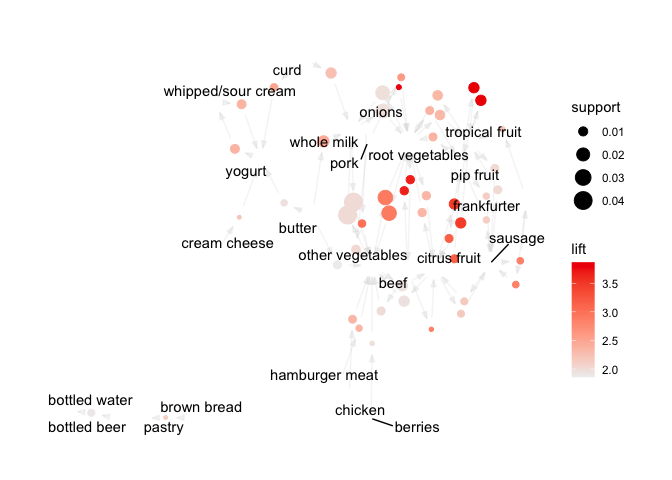

# Question 1

## using clusters to distinguish the color

    ##  fixed.acidity    volatile.acidity  citric.acid     residual.sugar  
    ##  Min.   : 3.800   Min.   :0.0800   Min.   :0.0000   Min.   : 0.600  
    ##  1st Qu.: 6.400   1st Qu.:0.2300   1st Qu.:0.2500   1st Qu.: 1.800  
    ##  Median : 7.000   Median :0.2900   Median :0.3100   Median : 3.000  
    ##  Mean   : 7.215   Mean   :0.3397   Mean   :0.3186   Mean   : 5.443  
    ##  3rd Qu.: 7.700   3rd Qu.:0.4000   3rd Qu.:0.3900   3rd Qu.: 8.100  
    ##  Max.   :15.900   Max.   :1.5800   Max.   :1.6600   Max.   :65.800  
    ##    chlorides       free.sulfur.dioxide total.sulfur.dioxide    density      
    ##  Min.   :0.00900   Min.   :  1.00      Min.   :  6.0        Min.   :0.9871  
    ##  1st Qu.:0.03800   1st Qu.: 17.00      1st Qu.: 77.0        1st Qu.:0.9923  
    ##  Median :0.04700   Median : 29.00      Median :118.0        Median :0.9949  
    ##  Mean   :0.05603   Mean   : 30.53      Mean   :115.7        Mean   :0.9947  
    ##  3rd Qu.:0.06500   3rd Qu.: 41.00      3rd Qu.:156.0        3rd Qu.:0.9970  
    ##  Max.   :0.61100   Max.   :289.00      Max.   :440.0        Max.   :1.0390  
    ##        pH          sulphates         alcohol         quality     
    ##  Min.   :2.720   Min.   :0.2200   Min.   : 8.00   Min.   :3.000  
    ##  1st Qu.:3.110   1st Qu.:0.4300   1st Qu.: 9.50   1st Qu.:5.000  
    ##  Median :3.210   Median :0.5100   Median :10.30   Median :6.000  
    ##  Mean   :3.219   Mean   :0.5313   Mean   :10.49   Mean   :5.818  
    ##  3rd Qu.:3.320   3rd Qu.:0.6000   3rd Qu.:11.30   3rd Qu.:6.000  
    ##  Max.   :4.010   Max.   :2.0000   Max.   :14.90   Max.   :9.000  
    ##     color          
    ##  Length:6497       
    ##  Class :character  
    ##  Mode  :character  
    ##                    
    ##                    
    ## 

    ##   fixed.acidity volatile.acidity citric.acid residual.sugar  chlorides
    ## 1      7.623219        0.4086378   0.2908725       3.076425 0.06580983
    ## 2      6.904812        0.2871659   0.3397642       7.244809 0.04859257
    ##   free.sulfur.dioxide total.sulfur.dioxide   density       pH sulphates
    ## 1            18.39868             63.26318 0.9945736 3.254882 0.5724145
    ## 2            39.75590            155.69246 0.9947903 3.190808 0.4999485
    ##    alcohol
    ## 1 10.79722
    ## 2 10.25932

    ## numeric(0)

    ## numeric(0)

    ##    [1]    1    2    3    4    5    6    7    8    9   10   11   12   13   14
    ##   [15]   17   18   19   20   21   22   23   24   25   26   27   28   29   30
    ##   [29]   31   32   34   35   36   37   38   39   40   41   42   43   44   45
    ##   [43]   46   48   49   50   51   52   53   55   56   57   59   60   61   63
    ##   [57]   64   65   66   67   68   69   70   71   72   73   74   75   76   77
    ##   [71]   78   79   81   82   83   84   85   86   88   90   94   95   96   97
    ##   [85]   98   99  100  101  102  103  104  105  106  107  108  109  111  112
    ##   [99]  113  114  115  116  117  118  119  120  121  122  123  124  125  126
    ##  [113]  127  128  129  130  132  133  134  135  136  137  138  139  140  141
    ##  [127]  142  143  144  145  147  148  149  150  151  152  153  154  159  160
    ##  [141]  161  162  163  166  167  168  169  170  171  172  173  174  175  176
    ##  [155]  177  178  179  180  181  182  183  184  185  186  187  188  192  194
    ##  [169]  195  197  198  199  200  201  203  204  205  206  207  209  210  211
    ##  [183]  212  213  214  215  217  218  219  221  222  223  224  225  226  227
    ##  [197]  228  229  230  231  232  233  234  235  236  237  238  239  240  241
    ##  [211]  242  243  244  245  246  247  248  249  250  251  252  253  254  255
    ##  [225]  257  258  259  260  261  262  263  264  265  266  267  268  269  270
    ##  [239]  271  272  273  274  275  276  277  278  279  280  281  282  283  284
    ##  [253]  285  286  287  288  289  290  291  292  293  294  295  296  297  298
    ##  [267]  299  300  301  302  303  304  305  306  307  308  309  310  311  312
    ##  [281]  313  315  316  317  318  319  320  321  322  323  324  325  326  327
    ##  [295]  328  329  330  331  332  334  335  336  337  338  339  340  341  342
    ##  [309]  343  344  345  346  347  348  349  350  351  352  353  354  356  357
    ##  [323]  358  359  360  361  362  363  364  365  366  367  368  369  370  371
    ##  [337]  372  373  374  375  376  377  378  379  380  381  382  383  384  385
    ##  [351]  386  387  388  389  390  391  392  393  394  395  396  398  399  400
    ##  [365]  402  403  404  405  406  407  408  409  410  411  412  413  414  417
    ##  [379]  419  420  421  422  423  424  425  426  427  428  429  430  431  432
    ##  [393]  433  434  435  436  437  438  439  440  441  442  443  444  445  446
    ##  [407]  447  448  449  450  451  452  453  454  455  456  457  458  459  460
    ##  [421]  461  462  463  465  466  467  468  469  470  471  472  473  474  475
    ##  [435]  476  477  478  479  480  481  482  483  484  485  486  487  488  489
    ##  [449]  490  491  492  493  494  495  496  497  499  500  501  502  503  504
    ##  [463]  505  506  507  508  509  510  511  512  513  514  515  517  518  519
    ##  [477]  520  521  522  526  527  528  529  530  531  532  533  534  535  536
    ##  [491]  537  538  539  540  541  542  543  544  545  546  547  548  549  550
    ##  [505]  551  552  553  554  555  556  557  558  559  560  561  564  565  566
    ##  [519]  567  568  569  570  571  572  573  574  575  576  577  578  579  580
    ##  [533]  581  582  583  584  585  586  587  588  589  590  591  593  594  595
    ##  [547]  596  597  598  599  600  601  602  603  604  605  606  607  608  609
    ##  [561]  610  611  612  613  614  615  616  617  618  619  620  621  622  623
    ##  [575]  624  625  626  627  628  629  630  631  632  633  634  635  636  639
    ##  [589]  640  641  642  643  644  645  646  647  648  649  651  653  654  655
    ##  [603]  656  657  658  659  660  661  662  663  664  665  666  667  668  669
    ##  [617]  670  671  672  674  675  676  677  678  679  680  681  682  683  684
    ##  [631]  686  687  688  689  690  691  692  693  696  697  698  699  700  701
    ##  [645]  702  703  704  705  706  707  708  709  710  711  712  713  714  715
    ##  [659]  716  717  718  719  720  721  722  723  725  726  727  728  729  730
    ##  [673]  731  732  733  734  735  736  737  738  739  740  741  743  744  745
    ##  [687]  746  747  748  749  750  751  752  753  754  755  756  757  758  759
    ##  [701]  760  761  762  763  764  765  766  767  768  769  770  771  774  775
    ##  [715]  776  777  778  779  780  781  782  783  784  785  786  787  788  789
    ##  [729]  791  793  794  795  796  797  798  799  800  801  802  803  804  805
    ##  [743]  806  807  808  809  810  811  812  813  814  815  816  817  818  819
    ##  [757]  820  821  822  823  824  825  826  827  828  829  830  831  832  833
    ##  [771]  834  835  836  837  838  839  840  841  842  843  844  845  846  847
    ##  [785]  848  849  850  851  852  854  855  856  857  858  859  860  861  862
    ##  [799]  863  864  865  866  867  868  869  870  871  872  873  874  875  876
    ##  [813]  877  878  879  880  881  882  883  884  885  886  887  888  889  890
    ##  [827]  891  892  893  894  895  896  897  898  899  900  901  902  903  904
    ##  [841]  905  907  908  909  910  911  912  913  914  915  916  917  918  919
    ##  [855]  920  921  922  923  924  925  926  927  928  929  930  931  932  933
    ##  [869]  934  935  936  937  938  939  940  941  942  943  944  945  946  947
    ##  [883]  948  949  950  951  952  953  954  955  956  957  958  959  960  961
    ##  [897]  962  963  964  965  966  967  969  970  971  972  973  974  975  976
    ##  [911]  977  979  980  981  982  983  984  985  986  987  988  989  990  991
    ##  [925]  992  993  994  995  996  997  998  999 1000 1001 1002 1003 1004 1005
    ##  [939] 1006 1007 1008 1009 1010 1011 1012 1013 1014 1015 1016 1017 1020 1021
    ##  [953] 1022 1023 1024 1025 1026 1027 1028 1029 1030 1031 1032 1033 1034 1035
    ##  [967] 1036 1037 1038 1039 1040 1041 1042 1043 1044 1045 1046 1047 1048 1049
    ##  [981] 1050 1051 1052 1053 1054 1055 1056 1057 1058 1059 1060 1061 1062 1063
    ##  [995] 1064 1065 1066 1067 1068 1069 1070 1071 1072 1073 1074 1075 1076 1077
    ## [1009] 1078 1079 1081 1083 1084 1085 1086 1087 1088 1089 1090 1091 1092 1093
    ## [1023] 1094 1095 1096 1097 1098 1099 1100 1101 1102 1103 1104 1105 1106 1107
    ## [1037] 1108 1109 1110 1111 1112 1113 1114 1115 1116 1117 1118 1119 1120 1121
    ## [1051] 1122 1123 1124 1125 1126 1127 1128 1129 1130 1131 1133 1134 1135 1136
    ## [1065] 1137 1138 1139 1140 1141 1142 1143 1144 1145 1146 1147 1148 1149 1150
    ## [1079] 1151 1152 1153 1154 1155 1156 1157 1158 1159 1160 1161 1162 1163 1164
    ## [1093] 1165 1166 1167 1168 1169 1170 1171 1172 1173 1174 1175 1176 1177 1178
    ## [1107] 1179 1180 1181 1182 1183 1184 1186 1187 1188 1190 1191 1192 1193 1194
    ## [1121] 1195 1196 1197 1198 1199 1200 1201 1202 1203 1204 1205 1206 1207 1208
    ## [1135] 1209 1210 1211 1212 1213 1214 1215 1216 1217 1218 1219 1220 1221 1222
    ## [1149] 1223 1224 1225 1226 1227 1228 1229 1230 1231 1232 1233 1234 1235 1236
    ## [1163] 1237 1238 1239 1240 1241 1242 1243 1244 1246 1247 1248 1249 1250 1251
    ## [1177] 1252 1253 1254 1255 1256 1257 1258 1259 1260 1261 1262 1263 1264 1265
    ## [1191] 1266 1267 1268 1269 1270 1271 1272 1273 1274 1275 1276 1277 1278 1279
    ## [1205] 1280 1281 1282 1283 1284 1285 1286 1287 1288 1289 1290 1291 1292 1293
    ## [1219] 1294 1295 1296 1297 1298 1299 1300 1301 1302 1303 1304 1305 1306 1307
    ## [1233] 1308 1309 1310 1311 1312 1313 1314 1315 1316 1317 1318 1319 1320 1321
    ## [1247] 1322 1323 1324 1325 1326 1327 1328 1329 1330 1331 1332 1333 1334 1335
    ## [1261] 1336 1337 1338 1339 1340 1341 1342 1343 1344 1345 1346 1347 1348 1349
    ## [1275] 1350 1351 1352 1353 1354 1355 1356 1357 1358 1359 1360 1361 1362 1363
    ## [1289] 1364 1365 1366 1367 1368 1369 1370 1371 1372 1373 1374 1375 1376 1377
    ## [1303] 1378 1379 1380 1381 1382 1383 1384 1385 1386 1387 1388 1389 1391 1392
    ## [1317] 1393 1394 1395 1396 1397 1398 1399 1400 1403 1404 1405 1406 1407 1408
    ## [1331] 1409 1410 1411 1412 1413 1414 1415 1416 1417 1418 1419 1421 1422 1423
    ## [1345] 1424 1425 1426 1427 1428 1429 1430 1431 1432 1433 1434 1435 1436 1437
    ## [1359] 1438 1439 1440 1441 1442 1443 1444 1445 1446 1447 1448 1449 1450 1451
    ## [1373] 1452 1453 1454 1455 1456 1457 1458 1459 1460 1461 1462 1463 1464 1465
    ## [1387] 1466 1467 1468 1469 1470 1471 1472 1473 1474 1475 1476 1477 1478 1479
    ## [1401] 1480 1481 1482 1483 1484 1485 1486 1487 1488 1489 1490 1491 1492 1493
    ## [1415] 1495 1496 1498 1499 1500 1501 1502 1503 1504 1505 1506 1507 1508 1509
    ## [1429] 1510 1511 1512 1513 1514 1515 1516 1517 1518 1519 1520 1521 1522 1523
    ## [1443] 1524 1525 1526 1527 1528 1529 1530 1531 1532 1533 1534 1535 1536 1537
    ## [1457] 1538 1539 1540 1541 1542 1543 1544 1545 1546 1547 1548 1549 1550 1551
    ## [1471] 1552 1553 1554 1555 1556 1557 1558 1563 1564 1565 1566 1567 1568 1569
    ## [1485] 1570 1571 1572 1573 1574 1575 1576 1577 1578 1579 1580 1581 1582 1583
    ## [1499] 1584 1585 1586 1587 1588 1589 1590 1591 1592 1593 1594 1595 1596 1597
    ## [1513] 1598 1599 1602 1605 1610 1611 1612 1616 1617 1620 1621 1631 1632 1652
    ## [1527] 1658 1663 1668 1669 1673 1674 1675 1676 1677 1678 1679 1697 1698 1715
    ## [1541] 1717 1720 1730 1738 1739 1740 1742 1743 1744 1747 1748 1753 1754 1762
    ## [1555] 1767 1769 1771 1772 1776 1778 1788 1808 1810 1814 1822 1841 1842 1847
    ## [1569] 1848 1853 1856 1857 1859 1862 1877 1878 1879 1900 1901 1902 1910 1919
    ## [1583] 1920 1929 1930 1932 1934 1935 1936 1946 1961 1964 1969 1974 1975 1977
    ## [1597] 1980 1985 1991 1993 1996 1997 1999 2000 2002 2006 2009 2012 2013 2016
    ## [1611] 2018 2028 2031 2034 2035 2039 2040 2045 2056 2063 2067 2072 2074 2076
    ## [1625] 2081 2087 2090 2091 2094 2113 2118 2119 2122 2123 2124 2126 2128 2130
    ## [1639] 2138 2147 2151 2155 2165 2166 2171 2178 2183 2185 2199 2201 2209 2211
    ## [1653] 2216 2223 2229 2256 2260 2263 2271 2277 2278 2279 2296 2302 2305 2309
    ## [1667] 2323 2327 2332 2340 2341 2355 2367 2375 2376 2380 2391 2393 2399 2416
    ## [1681] 2420 2422 2424 2428 2429 2432 2433 2435 2443 2447 2449 2450 2460 2469
    ## [1695] 2473 2474 2477 2479 2485 2487 2489 2495 2497 2498 2505 2506 2513 2514
    ## [1709] 2515 2518 2519 2525 2526 2530 2536 2542 2545 2548 2549 2552 2557 2558
    ## [1723] 2561 2565 2568 2569 2570 2571 2573 2575 2579 2580 2582 2583 2591 2593
    ## [1737] 2596 2600 2605 2607 2610 2612 2617 2627 2636 2637 2638 2639 2641 2642
    ## [1751] 2644 2645 2646 2647 2648 2652 2654 2668 2695 2707 2708 2710 2711 2713
    ## [1765] 2714 2715 2716 2718 2720 2722 2727 2728 2739 2740 2752 2753 2764 2766
    ## [1779] 2768 2773 2779 2782 2787 2789 2792 2798 2799 2800 2801 2803 2804 2810
    ## [1793] 2813 2814 2816 2819 2824 2825 2826 2827 2828 2829 2832 2836 2847 2848
    ## [1807] 2855 2864 2888 2889 2890 2892 2893 2894 2906 2909 2918 2920 2928 2929
    ## [1821] 2930 2931 2934 2949 2958 2963 2966 2981 2982 2983 2987 2991 2992 2993
    ## [1835] 2995 2999 3004 3006 3007 3010 3011 3015 3019 3021 3022 3028 3029 3031
    ## [1849] 3032 3033 3035 3037 3046 3056 3067 3068 3072 3074 3077 3083 3086 3091
    ## [1863] 3096 3098 3118 3133 3136 3138 3139 3141 3142 3143 3144 3148 3159 3161
    ## [1877] 3164 3167 3174 3176 3181 3193 3198 3199 3202 3203 3211 3212 3220 3228
    ## [1891] 3229 3231 3233 3239 3247 3248 3256 3266 3268 3271 3276 3302 3310 3316
    ## [1905] 3319 3326 3330 3336 3338 3339 3346 3348 3354 3358 3362 3369 3374 3383
    ## [1919] 3401 3412 3413 3414 3418 3421 3422 3425 3436 3437 3439 3441 3444 3451
    ## [1933] 3453 3462 3477 3479 3481 3485 3486 3498 3499 3503 3508 3511 3515 3517
    ## [1947] 3523 3524 3525 3526 3532 3534 3538 3556 3557 3559 3560 3562 3578 3589
    ## [1961] 3590 3592 3607 3609 3610 3614 3615 3617 3626 3632 3635 3638 3639 3641
    ## [1975] 3642 3643 3645 3653 3654 3661 3668 3681 3683 3686 3692 3701 3713 3716
    ## [1989] 3738 3739 3743 3746 3748 3749 3750 3752 3753 3756 3757 3758 3759 3761
    ## [2003] 3763 3779 3784 3785 3786 3788 3794 3796 3797 3813 3816 3832 3834 3848
    ## [2017] 3851 3862 3872 3873 3877 3880 3881 3889 3890 3893 3898 3913 3919 3939
    ## [2031] 3942 3944 3947 3953 3954 3957 3961 3970 3972 3973 3977 3982 3983 3984
    ## [2045] 3988 3989 3997 3998 3999 4000 4001 4006 4007 4015 4018 4061 4062 4068
    ## [2059] 4072 4074 4077 4090 4096 4112 4115 4118 4127 4128 4134 4136 4139 4143
    ## [2073] 4152 4160 4162 4166 4171 4172 4178 4187 4194 4203 4204 4205 4209 4212
    ## [2087] 4214 4224 4230 4231 4235 4238 4239 4240 4242 4246 4252 4259 4263 4264
    ## [2101] 4273 4276 4285 4291 4294 4297 4300 4318 4320 4322 4326 4329 4333 4337
    ## [2115] 4339 4343 4344 4345 4353 4354 4357 4358 4366 4373 4378 4379 4386 4393
    ## [2129] 4395 4396 4402 4403 4404 4410 4412 4414 4415 4417 4423 4432 4438 4439
    ## [2143] 4440 4441 4442 4443 4444 4445 4446 4447 4451 4453 4454 4457 4461 4462
    ## [2157] 4463 4464 4469 4471 4473 4475 4479 4480 4481 4483 4485 4486 4487 4488
    ## [2171] 4494 4498 4500 4501 4503 4507 4508 4509 4512 4514 4515 4518 4520 4526
    ## [2185] 4531 4534 4535 4536 4538 4539 4541 4543 4546 4547 4550 4551 4552 4553
    ## [2199] 4554 4556 4557 4558 4559 4562 4569 4571 4581 4584 4588 4598 4603 4611
    ## [2213] 4612 4613 4614 4615 4616 4619 4620 4621 4623 4624 4632 4635 4638 4645
    ## [2227] 4653 4654 4656 4659 4669 4671 4675 4678 4680 4682 4683 4684 4685 4686
    ## [2241] 4688 4689 4690 4694 4695 4696 4701 4710 4711 4716 4717 4719 4722 4723
    ## [2255] 4727 4728 4736 4741 4743 4750 4753 4760 4768 4771 4776 4778 4779 4780
    ## [2269] 4781 4783 4784 4786 4792 4794 4802 4806 4810 4814 4815 4817 4818 4819
    ## [2283] 4820 4821 4825 4831 4832 4833 4839 4843 4844 4852 4853 4861 4863 4866
    ## [2297] 4871 4872 4875 4884 4890 4891 4893 4899 4900 4901 4902 4903 4905 4909
    ## [2311] 4912 4913 4915 4916 4917 4918 4921 4922 4923 4927 4934 4938 4939 4941
    ## [2325] 4942 4948 4949 4951 4952 4953 4957 4958 4959 4960 4961 4963 4964 4965
    ## [2339] 4988 4989 4992 4999 5003 5004 5006 5017 5021 5022 5033 5034 5035 5036
    ## [2353] 5040 5042 5043 5047 5050 5051 5053 5054 5055 5060 5063 5068 5071 5073
    ## [2367] 5076 5079 5080 5082 5083 5084 5086 5088 5089 5095 5103 5111 5113 5114
    ## [2381] 5115 5117 5128 5132 5136 5137 5139 5140 5154 5156 5157 5159 5160 5161
    ## [2395] 5163 5164 5165 5166 5167 5168 5169 5170 5171 5172 5173 5179 5182 5183
    ## [2409] 5184 5185 5190 5194 5200 5204 5207 5211 5215 5222 5224 5235 5236 5238
    ## [2423] 5239 5246 5247 5252 5254 5262 5268 5269 5271 5272 5273 5276 5278 5279
    ## [2437] 5287 5292 5294 5298 5306 5310 5314 5326 5328 5335 5336 5351 5356 5360
    ## [2451] 5361 5362 5363 5373 5375 5377 5378 5379 5382 5385 5396 5397 5400 5401
    ## [2465] 5403 5404 5405 5406 5407 5408 5409 5415 5424 5425 5427 5429 5436 5437
    ## [2479] 5440 5443 5444 5446 5448 5449 5450 5452 5456 5457 5464 5465 5475 5477
    ## [2493] 5479 5485 5487 5490 5493 5495 5500 5501 5502 5503 5504 5505 5506 5507
    ## [2507] 5512 5513 5515 5519 5522 5523 5524 5525 5526 5527 5530 5531 5533 5534
    ## [2521] 5536 5538 5542 5548 5552 5555 5557 5565 5572 5583 5585 5586 5589 5591
    ## [2535] 5592 5602 5606 5608 5615 5619 5620 5621 5625 5628 5630 5639 5649 5651
    ## [2549] 5655 5659 5660 5661 5664 5671 5673 5674 5677 5678 5679 5684 5685 5686
    ## [2563] 5687 5688 5691 5693 5694 5695 5697 5700 5703 5704 5708 5711 5712 5713
    ## [2577] 5714 5715 5723 5724 5729 5734 5738 5749 5765 5768 5771 5773 5781 5783
    ## [2591] 5784 5786 5789 5790 5792 5793 5794 5795 5796 5799 5800 5801 5805 5808
    ## [2605] 5809 5813 5820 5823 5824 5827 5831 5832 5837 5839 5843 5846 5850 5851
    ## [2619] 5852 5853 5864 5878 5883 5884 5885 5886 5888 5897 5898 5908 5911 5913
    ## [2633] 5916 5924 5939 5943 5944 5945 5946 5950 5968 5971 5973 5977 5983 5987
    ## [2647] 5988 6007 6011 6013 6031 6032 6036 6047 6053 6062 6068 6069 6070 6071
    ## [2661] 6072 6076 6083 6085 6086 6087 6091 6092 6094 6096 6098 6099 6103 6106
    ## [2675] 6107 6109 6111 6112 6113 6116 6117 6118 6122 6127 6128 6134 6137 6139
    ## [2689] 6140 6141 6142 6143 6144 6145 6146 6147 6149 6150 6152 6153 6154 6155
    ## [2703] 6159 6160 6161 6170 6171 6172 6173 6174 6176 6177 6178 6184 6187 6197
    ## [2717] 6199 6205 6206 6208 6209 6210 6211 6216 6221 6224 6227 6228 6229 6231
    ## [2731] 6242 6246 6247 6249 6250 6253 6259 6260 6273 6277 6281 6282 6296 6303
    ## [2745] 6308 6310 6313 6315 6316 6319 6320 6321 6324 6326 6329 6330 6334 6335
    ## [2759] 6336 6339 6344 6347 6352 6353 6354 6355 6362 6365 6373 6377 6378 6379
    ## [2773] 6385 6397 6404 6405 6407 6408 6411 6418 6427 6429 6433 6434 6435 6436
    ## [2787] 6439 6442 6445 6447 6452 6453 6454 6461 6462 6463 6465 6467 6469 6471
    ## [2801] 6475 6477 6478 6487 6490 6493 6496 6497

    ##    [1]   15   16   33   47   54   58   62   80   87   89   91   92   93  110
    ##   [15]  131  146  155  156  157  158  164  165  189  190  191  193  196  202
    ##   [29]  208  216  220  256  314  333  355  397  401  415  416  418  464  498
    ##   [43]  516  523  524  525  562  563  592  637  638  650  652  673  685  694
    ##   [57]  695  724  742  772  773  790  792  853  906  968  978 1018 1019 1080
    ##   [71] 1082 1132 1185 1189 1245 1390 1401 1402 1420 1494 1497 1559 1560 1561
    ##   [85] 1562 1600 1601 1603 1604 1606 1607 1608 1609 1613 1614 1615 1618 1619
    ##   [99] 1622 1623 1624 1625 1626 1627 1628 1629 1630 1633 1634 1635 1636 1637
    ##  [113] 1638 1639 1640 1641 1642 1643 1644 1645 1646 1647 1648 1649 1650 1651
    ##  [127] 1653 1654 1655 1656 1657 1659 1660 1661 1662 1664 1665 1666 1667 1670
    ##  [141] 1671 1672 1680 1681 1682 1683 1684 1685 1686 1687 1688 1689 1690 1691
    ##  [155] 1692 1693 1694 1695 1696 1699 1700 1701 1702 1703 1704 1705 1706 1707
    ##  [169] 1708 1709 1710 1711 1712 1713 1714 1716 1718 1719 1721 1722 1723 1724
    ##  [183] 1725 1726 1727 1728 1729 1731 1732 1733 1734 1735 1736 1737 1741 1745
    ##  [197] 1746 1749 1750 1751 1752 1755 1756 1757 1758 1759 1760 1761 1763 1764
    ##  [211] 1765 1766 1768 1770 1773 1774 1775 1777 1779 1780 1781 1782 1783 1784
    ##  [225] 1785 1786 1787 1789 1790 1791 1792 1793 1794 1795 1796 1797 1798 1799
    ##  [239] 1800 1801 1802 1803 1804 1805 1806 1807 1809 1811 1812 1813 1815 1816
    ##  [253] 1817 1818 1819 1820 1821 1823 1824 1825 1826 1827 1828 1829 1830 1831
    ##  [267] 1832 1833 1834 1835 1836 1837 1838 1839 1840 1843 1844 1845 1846 1849
    ##  [281] 1850 1851 1852 1854 1855 1858 1860 1861 1863 1864 1865 1866 1867 1868
    ##  [295] 1869 1870 1871 1872 1873 1874 1875 1876 1880 1881 1882 1883 1884 1885
    ##  [309] 1886 1887 1888 1889 1890 1891 1892 1893 1894 1895 1896 1897 1898 1899
    ##  [323] 1903 1904 1905 1906 1907 1908 1909 1911 1912 1913 1914 1915 1916 1917
    ##  [337] 1918 1921 1922 1923 1924 1925 1926 1927 1928 1931 1933 1937 1938 1939
    ##  [351] 1940 1941 1942 1943 1944 1945 1947 1948 1949 1950 1951 1952 1953 1954
    ##  [365] 1955 1956 1957 1958 1959 1960 1962 1963 1965 1966 1967 1968 1970 1971
    ##  [379] 1972 1973 1976 1978 1979 1981 1982 1983 1984 1986 1987 1988 1989 1990
    ##  [393] 1992 1994 1995 1998 2001 2003 2004 2005 2007 2008 2010 2011 2014 2015
    ##  [407] 2017 2019 2020 2021 2022 2023 2024 2025 2026 2027 2029 2030 2032 2033
    ##  [421] 2036 2037 2038 2041 2042 2043 2044 2046 2047 2048 2049 2050 2051 2052
    ##  [435] 2053 2054 2055 2057 2058 2059 2060 2061 2062 2064 2065 2066 2068 2069
    ##  [449] 2070 2071 2073 2075 2077 2078 2079 2080 2082 2083 2084 2085 2086 2088
    ##  [463] 2089 2092 2093 2095 2096 2097 2098 2099 2100 2101 2102 2103 2104 2105
    ##  [477] 2106 2107 2108 2109 2110 2111 2112 2114 2115 2116 2117 2120 2121 2125
    ##  [491] 2127 2129 2131 2132 2133 2134 2135 2136 2137 2139 2140 2141 2142 2143
    ##  [505] 2144 2145 2146 2148 2149 2150 2152 2153 2154 2156 2157 2158 2159 2160
    ##  [519] 2161 2162 2163 2164 2167 2168 2169 2170 2172 2173 2174 2175 2176 2177
    ##  [533] 2179 2180 2181 2182 2184 2186 2187 2188 2189 2190 2191 2192 2193 2194
    ##  [547] 2195 2196 2197 2198 2200 2202 2203 2204 2205 2206 2207 2208 2210 2212
    ##  [561] 2213 2214 2215 2217 2218 2219 2220 2221 2222 2224 2225 2226 2227 2228
    ##  [575] 2230 2231 2232 2233 2234 2235 2236 2237 2238 2239 2240 2241 2242 2243
    ##  [589] 2244 2245 2246 2247 2248 2249 2250 2251 2252 2253 2254 2255 2257 2258
    ##  [603] 2259 2261 2262 2264 2265 2266 2267 2268 2269 2270 2272 2273 2274 2275
    ##  [617] 2276 2280 2281 2282 2283 2284 2285 2286 2287 2288 2289 2290 2291 2292
    ##  [631] 2293 2294 2295 2297 2298 2299 2300 2301 2303 2304 2306 2307 2308 2310
    ##  [645] 2311 2312 2313 2314 2315 2316 2317 2318 2319 2320 2321 2322 2324 2325
    ##  [659] 2326 2328 2329 2330 2331 2333 2334 2335 2336 2337 2338 2339 2342 2343
    ##  [673] 2344 2345 2346 2347 2348 2349 2350 2351 2352 2353 2354 2356 2357 2358
    ##  [687] 2359 2360 2361 2362 2363 2364 2365 2366 2368 2369 2370 2371 2372 2373
    ##  [701] 2374 2377 2378 2379 2381 2382 2383 2384 2385 2386 2387 2388 2389 2390
    ##  [715] 2392 2394 2395 2396 2397 2398 2400 2401 2402 2403 2404 2405 2406 2407
    ##  [729] 2408 2409 2410 2411 2412 2413 2414 2415 2417 2418 2419 2421 2423 2425
    ##  [743] 2426 2427 2430 2431 2434 2436 2437 2438 2439 2440 2441 2442 2444 2445
    ##  [757] 2446 2448 2451 2452 2453 2454 2455 2456 2457 2458 2459 2461 2462 2463
    ##  [771] 2464 2465 2466 2467 2468 2470 2471 2472 2475 2476 2478 2480 2481 2482
    ##  [785] 2483 2484 2486 2488 2490 2491 2492 2493 2494 2496 2499 2500 2501 2502
    ##  [799] 2503 2504 2507 2508 2509 2510 2511 2512 2516 2517 2520 2521 2522 2523
    ##  [813] 2524 2527 2528 2529 2531 2532 2533 2534 2535 2537 2538 2539 2540 2541
    ##  [827] 2543 2544 2546 2547 2550 2551 2553 2554 2555 2556 2559 2560 2562 2563
    ##  [841] 2564 2566 2567 2572 2574 2576 2577 2578 2581 2584 2585 2586 2587 2588
    ##  [855] 2589 2590 2592 2594 2595 2597 2598 2599 2601 2602 2603 2604 2606 2608
    ##  [869] 2609 2611 2613 2614 2615 2616 2618 2619 2620 2621 2622 2623 2624 2625
    ##  [883] 2626 2628 2629 2630 2631 2632 2633 2634 2635 2640 2643 2649 2650 2651
    ##  [897] 2653 2655 2656 2657 2658 2659 2660 2661 2662 2663 2664 2665 2666 2667
    ##  [911] 2669 2670 2671 2672 2673 2674 2675 2676 2677 2678 2679 2680 2681 2682
    ##  [925] 2683 2684 2685 2686 2687 2688 2689 2690 2691 2692 2693 2694 2696 2697
    ##  [939] 2698 2699 2700 2701 2702 2703 2704 2705 2706 2709 2712 2717 2719 2721
    ##  [953] 2723 2724 2725 2726 2729 2730 2731 2732 2733 2734 2735 2736 2737 2738
    ##  [967] 2741 2742 2743 2744 2745 2746 2747 2748 2749 2750 2751 2754 2755 2756
    ##  [981] 2757 2758 2759 2760 2761 2762 2763 2765 2767 2769 2770 2771 2772 2774
    ##  [995] 2775 2776 2777 2778 2780 2781 2783 2784 2785 2786 2788 2790 2791 2793
    ## [1009] 2794 2795 2796 2797 2802 2805 2806 2807 2808 2809 2811 2812 2815 2817
    ## [1023] 2818 2820 2821 2822 2823 2830 2831 2833 2834 2835 2837 2838 2839 2840
    ## [1037] 2841 2842 2843 2844 2845 2846 2849 2850 2851 2852 2853 2854 2856 2857
    ## [1051] 2858 2859 2860 2861 2862 2863 2865 2866 2867 2868 2869 2870 2871 2872
    ## [1065] 2873 2874 2875 2876 2877 2878 2879 2880 2881 2882 2883 2884 2885 2886
    ## [1079] 2887 2891 2895 2896 2897 2898 2899 2900 2901 2902 2903 2904 2905 2907
    ## [1093] 2908 2910 2911 2912 2913 2914 2915 2916 2917 2919 2921 2922 2923 2924
    ## [1107] 2925 2926 2927 2932 2933 2935 2936 2937 2938 2939 2940 2941 2942 2943
    ## [1121] 2944 2945 2946 2947 2948 2950 2951 2952 2953 2954 2955 2956 2957 2959
    ## [1135] 2960 2961 2962 2964 2965 2967 2968 2969 2970 2971 2972 2973 2974 2975
    ## [1149] 2976 2977 2978 2979 2980 2984 2985 2986 2988 2989 2990 2994 2996 2997
    ## [1163] 2998 3000 3001 3002 3003 3005 3008 3009 3012 3013 3014 3016 3017 3018
    ## [1177] 3020 3023 3024 3025 3026 3027 3030 3034 3036 3038 3039 3040 3041 3042
    ## [1191] 3043 3044 3045 3047 3048 3049 3050 3051 3052 3053 3054 3055 3057 3058
    ## [1205] 3059 3060 3061 3062 3063 3064 3065 3066 3069 3070 3071 3073 3075 3076
    ## [1219] 3078 3079 3080 3081 3082 3084 3085 3087 3088 3089 3090 3092 3093 3094
    ## [1233] 3095 3097 3099 3100 3101 3102 3103 3104 3105 3106 3107 3108 3109 3110
    ## [1247] 3111 3112 3113 3114 3115 3116 3117 3119 3120 3121 3122 3123 3124 3125
    ## [1261] 3126 3127 3128 3129 3130 3131 3132 3134 3135 3137 3140 3145 3146 3147
    ## [1275] 3149 3150 3151 3152 3153 3154 3155 3156 3157 3158 3160 3162 3163 3165
    ## [1289] 3166 3168 3169 3170 3171 3172 3173 3175 3177 3178 3179 3180 3182 3183
    ## [1303] 3184 3185 3186 3187 3188 3189 3190 3191 3192 3194 3195 3196 3197 3200
    ## [1317] 3201 3204 3205 3206 3207 3208 3209 3210 3213 3214 3215 3216 3217 3218
    ## [1331] 3219 3221 3222 3223 3224 3225 3226 3227 3230 3232 3234 3235 3236 3237
    ## [1345] 3238 3240 3241 3242 3243 3244 3245 3246 3249 3250 3251 3252 3253 3254
    ## [1359] 3255 3257 3258 3259 3260 3261 3262 3263 3264 3265 3267 3269 3270 3272
    ## [1373] 3273 3274 3275 3277 3278 3279 3280 3281 3282 3283 3284 3285 3286 3287
    ## [1387] 3288 3289 3290 3291 3292 3293 3294 3295 3296 3297 3298 3299 3300 3301
    ## [1401] 3303 3304 3305 3306 3307 3308 3309 3311 3312 3313 3314 3315 3317 3318
    ## [1415] 3320 3321 3322 3323 3324 3325 3327 3328 3329 3331 3332 3333 3334 3335
    ## [1429] 3337 3340 3341 3342 3343 3344 3345 3347 3349 3350 3351 3352 3353 3355
    ## [1443] 3356 3357 3359 3360 3361 3363 3364 3365 3366 3367 3368 3370 3371 3372
    ## [1457] 3373 3375 3376 3377 3378 3379 3380 3381 3382 3384 3385 3386 3387 3388
    ## [1471] 3389 3390 3391 3392 3393 3394 3395 3396 3397 3398 3399 3400 3402 3403
    ## [1485] 3404 3405 3406 3407 3408 3409 3410 3411 3415 3416 3417 3419 3420 3423
    ## [1499] 3424 3426 3427 3428 3429 3430 3431 3432 3433 3434 3435 3438 3440 3442
    ## [1513] 3443 3445 3446 3447 3448 3449 3450 3452 3454 3455 3456 3457 3458 3459
    ## [1527] 3460 3461 3463 3464 3465 3466 3467 3468 3469 3470 3471 3472 3473 3474
    ## [1541] 3475 3476 3478 3480 3482 3483 3484 3487 3488 3489 3490 3491 3492 3493
    ## [1555] 3494 3495 3496 3497 3500 3501 3502 3504 3505 3506 3507 3509 3510 3512
    ## [1569] 3513 3514 3516 3518 3519 3520 3521 3522 3527 3528 3529 3530 3531 3533
    ## [1583] 3535 3536 3537 3539 3540 3541 3542 3543 3544 3545 3546 3547 3548 3549
    ## [1597] 3550 3551 3552 3553 3554 3555 3558 3561 3563 3564 3565 3566 3567 3568
    ## [1611] 3569 3570 3571 3572 3573 3574 3575 3576 3577 3579 3580 3581 3582 3583
    ## [1625] 3584 3585 3586 3587 3588 3591 3593 3594 3595 3596 3597 3598 3599 3600
    ## [1639] 3601 3602 3603 3604 3605 3606 3608 3611 3612 3613 3616 3618 3619 3620
    ## [1653] 3621 3622 3623 3624 3625 3627 3628 3629 3630 3631 3633 3634 3636 3637
    ## [1667] 3640 3644 3646 3647 3648 3649 3650 3651 3652 3655 3656 3657 3658 3659
    ## [1681] 3660 3662 3663 3664 3665 3666 3667 3669 3670 3671 3672 3673 3674 3675
    ## [1695] 3676 3677 3678 3679 3680 3682 3684 3685 3687 3688 3689 3690 3691 3693
    ## [1709] 3694 3695 3696 3697 3698 3699 3700 3702 3703 3704 3705 3706 3707 3708
    ## [1723] 3709 3710 3711 3712 3714 3715 3717 3718 3719 3720 3721 3722 3723 3724
    ## [1737] 3725 3726 3727 3728 3729 3730 3731 3732 3733 3734 3735 3736 3737 3740
    ## [1751] 3741 3742 3744 3745 3747 3751 3754 3755 3760 3762 3764 3765 3766 3767
    ## [1765] 3768 3769 3770 3771 3772 3773 3774 3775 3776 3777 3778 3780 3781 3782
    ## [1779] 3783 3787 3789 3790 3791 3792 3793 3795 3798 3799 3800 3801 3802 3803
    ## [1793] 3804 3805 3806 3807 3808 3809 3810 3811 3812 3814 3815 3817 3818 3819
    ## [1807] 3820 3821 3822 3823 3824 3825 3826 3827 3828 3829 3830 3831 3833 3835
    ## [1821] 3836 3837 3838 3839 3840 3841 3842 3843 3844 3845 3846 3847 3849 3850
    ## [1835] 3852 3853 3854 3855 3856 3857 3858 3859 3860 3861 3863 3864 3865 3866
    ## [1849] 3867 3868 3869 3870 3871 3874 3875 3876 3878 3879 3882 3883 3884 3885
    ## [1863] 3886 3887 3888 3891 3892 3894 3895 3896 3897 3899 3900 3901 3902 3903
    ## [1877] 3904 3905 3906 3907 3908 3909 3910 3911 3912 3914 3915 3916 3917 3918
    ## [1891] 3920 3921 3922 3923 3924 3925 3926 3927 3928 3929 3930 3931 3932 3933
    ## [1905] 3934 3935 3936 3937 3938 3940 3941 3943 3945 3946 3948 3949 3950 3951
    ## [1919] 3952 3955 3956 3958 3959 3960 3962 3963 3964 3965 3966 3967 3968 3969
    ## [1933] 3971 3974 3975 3976 3978 3979 3980 3981 3985 3986 3987 3990 3991 3992
    ## [1947] 3993 3994 3995 3996 4002 4003 4004 4005 4008 4009 4010 4011 4012 4013
    ## [1961] 4014 4016 4017 4019 4020 4021 4022 4023 4024 4025 4026 4027 4028 4029
    ## [1975] 4030 4031 4032 4033 4034 4035 4036 4037 4038 4039 4040 4041 4042 4043
    ## [1989] 4044 4045 4046 4047 4048 4049 4050 4051 4052 4053 4054 4055 4056 4057
    ## [2003] 4058 4059 4060 4063 4064 4065 4066 4067 4069 4070 4071 4073 4075 4076
    ## [2017] 4078 4079 4080 4081 4082 4083 4084 4085 4086 4087 4088 4089 4091 4092
    ## [2031] 4093 4094 4095 4097 4098 4099 4100 4101 4102 4103 4104 4105 4106 4107
    ## [2045] 4108 4109 4110 4111 4113 4114 4116 4117 4119 4120 4121 4122 4123 4124
    ## [2059] 4125 4126 4129 4130 4131 4132 4133 4135 4137 4138 4140 4141 4142 4144
    ## [2073] 4145 4146 4147 4148 4149 4150 4151 4153 4154 4155 4156 4157 4158 4159
    ## [2087] 4161 4163 4164 4165 4167 4168 4169 4170 4173 4174 4175 4176 4177 4179
    ## [2101] 4180 4181 4182 4183 4184 4185 4186 4188 4189 4190 4191 4192 4193 4195
    ## [2115] 4196 4197 4198 4199 4200 4201 4202 4206 4207 4208 4210 4211 4213 4215
    ## [2129] 4216 4217 4218 4219 4220 4221 4222 4223 4225 4226 4227 4228 4229 4232
    ## [2143] 4233 4234 4236 4237 4241 4243 4244 4245 4247 4248 4249 4250 4251 4253
    ## [2157] 4254 4255 4256 4257 4258 4260 4261 4262 4265 4266 4267 4268 4269 4270
    ## [2171] 4271 4272 4274 4275 4277 4278 4279 4280 4281 4282 4283 4284 4286 4287
    ## [2185] 4288 4289 4290 4292 4293 4295 4296 4298 4299 4301 4302 4303 4304 4305
    ## [2199] 4306 4307 4308 4309 4310 4311 4312 4313 4314 4315 4316 4317 4319 4321
    ## [2213] 4323 4324 4325 4327 4328 4330 4331 4332 4334 4335 4336 4338 4340 4341
    ## [2227] 4342 4346 4347 4348 4349 4350 4351 4352 4355 4356 4359 4360 4361 4362
    ## [2241] 4363 4364 4365 4367 4368 4369 4370 4371 4372 4374 4375 4376 4377 4380
    ## [2255] 4381 4382 4383 4384 4385 4387 4388 4389 4390 4391 4392 4394 4397 4398
    ## [2269] 4399 4400 4401 4405 4406 4407 4408 4409 4411 4413 4416 4418 4419 4420
    ## [2283] 4421 4422 4424 4425 4426 4427 4428 4429 4430 4431 4433 4434 4435 4436
    ## [2297] 4437 4448 4449 4450 4452 4455 4456 4458 4459 4460 4465 4466 4467 4468
    ## [2311] 4470 4472 4474 4476 4477 4478 4482 4484 4489 4490 4491 4492 4493 4495
    ## [2325] 4496 4497 4499 4502 4504 4505 4506 4510 4511 4513 4516 4517 4519 4521
    ## [2339] 4522 4523 4524 4525 4527 4528 4529 4530 4532 4533 4537 4540 4542 4544
    ## [2353] 4545 4548 4549 4555 4560 4561 4563 4564 4565 4566 4567 4568 4570 4572
    ## [2367] 4573 4574 4575 4576 4577 4578 4579 4580 4582 4583 4585 4586 4587 4589
    ## [2381] 4590 4591 4592 4593 4594 4595 4596 4597 4599 4600 4601 4602 4604 4605
    ## [2395] 4606 4607 4608 4609 4610 4617 4618 4622 4625 4626 4627 4628 4629 4630
    ## [2409] 4631 4633 4634 4636 4637 4639 4640 4641 4642 4643 4644 4646 4647 4648
    ## [2423] 4649 4650 4651 4652 4655 4657 4658 4660 4661 4662 4663 4664 4665 4666
    ## [2437] 4667 4668 4670 4672 4673 4674 4676 4677 4679 4681 4687 4691 4692 4693
    ## [2451] 4697 4698 4699 4700 4702 4703 4704 4705 4706 4707 4708 4709 4712 4713
    ## [2465] 4714 4715 4718 4720 4721 4724 4725 4726 4729 4730 4731 4732 4733 4734
    ## [2479] 4735 4737 4738 4739 4740 4742 4744 4745 4746 4747 4748 4749 4751 4752
    ## [2493] 4754 4755 4756 4757 4758 4759 4761 4762 4763 4764 4765 4766 4767 4769
    ## [2507] 4770 4772 4773 4774 4775 4777 4782 4785 4787 4788 4789 4790 4791 4793
    ## [2521] 4795 4796 4797 4798 4799 4800 4801 4803 4804 4805 4807 4808 4809 4811
    ## [2535] 4812 4813 4816 4822 4823 4824 4826 4827 4828 4829 4830 4834 4835 4836
    ## [2549] 4837 4838 4840 4841 4842 4845 4846 4847 4848 4849 4850 4851 4854 4855
    ## [2563] 4856 4857 4858 4859 4860 4862 4864 4865 4867 4868 4869 4870 4873 4874
    ## [2577] 4876 4877 4878 4879 4880 4881 4882 4883 4885 4886 4887 4888 4889 4892
    ## [2591] 4894 4895 4896 4897 4898 4904 4906 4907 4908 4910 4911 4914 4919 4920
    ## [2605] 4924 4925 4926 4928 4929 4930 4931 4932 4933 4935 4936 4937 4940 4943
    ## [2619] 4944 4945 4946 4947 4950 4954 4955 4956 4962 4966 4967 4968 4969 4970
    ## [2633] 4971 4972 4973 4974 4975 4976 4977 4978 4979 4980 4981 4982 4983 4984
    ## [2647] 4985 4986 4987 4990 4991 4993 4994 4995 4996 4997 4998 5000 5001 5002
    ## [2661] 5005 5007 5008 5009 5010 5011 5012 5013 5014 5015 5016 5018 5019 5020
    ## [2675] 5023 5024 5025 5026 5027 5028 5029 5030 5031 5032 5037 5038 5039 5041
    ## [2689] 5044 5045 5046 5048 5049 5052 5056 5057 5058 5059 5061 5062 5064 5065
    ## [2703] 5066 5067 5069 5070 5072 5074 5075 5077 5078 5081 5085 5087 5090 5091
    ## [2717] 5092 5093 5094 5096 5097 5098 5099 5100 5101 5102 5104 5105 5106 5107
    ## [2731] 5108 5109 5110 5112 5116 5118 5119 5120 5121 5122 5123 5124 5125 5126
    ## [2745] 5127 5129 5130 5131 5133 5134 5135 5138 5141 5142 5143 5144 5145 5146
    ## [2759] 5147 5148 5149 5150 5151 5152 5153 5155 5158 5162 5174 5175 5176 5177
    ## [2773] 5178 5180 5181 5186 5187 5188 5189 5191 5192 5193 5195 5196 5197 5198
    ## [2787] 5199 5201 5202 5203 5205 5206 5208 5209 5210 5212 5213 5214 5216 5217
    ## [2801] 5218 5219 5220 5221 5223 5225 5226 5227 5228 5229 5230 5231 5232 5233
    ## [2815] 5234 5237 5240 5241 5242 5243 5244 5245 5248 5249 5250 5251 5253 5255
    ## [2829] 5256 5257 5258 5259 5260 5261 5263 5264 5265 5266 5267 5270 5274 5275
    ## [2843] 5277 5280 5281 5282 5283 5284 5285 5286 5288 5289 5290 5291 5293 5295
    ## [2857] 5296 5297 5299 5300 5301 5302 5303 5304 5305 5307 5308 5309 5311 5312
    ## [2871] 5313 5315 5316 5317 5318 5319 5320 5321 5322 5323 5324 5325 5327 5329
    ## [2885] 5330 5331 5332 5333 5334 5337 5338 5339 5340 5341 5342 5343 5344 5345
    ## [2899] 5346 5347 5348 5349 5350 5352 5353 5354 5355 5357 5358 5359 5364 5365
    ## [2913] 5366 5367 5368 5369 5370 5371 5372 5374 5376 5380 5381 5383 5384 5386
    ## [2927] 5387 5388 5389 5390 5391 5392 5393 5394 5395 5398 5399 5402 5410 5411
    ## [2941] 5412 5413 5414 5416 5417 5418 5419 5420 5421 5422 5423 5426 5428 5430
    ## [2955] 5431 5432 5433 5434 5435 5438 5439 5441 5442 5445 5447 5451 5453 5454
    ## [2969] 5455 5458 5459 5460 5461 5462 5463 5466 5467 5468 5469 5470 5471 5472
    ## [2983] 5473 5474 5476 5478 5480 5481 5482 5483 5484 5486 5488 5489 5491 5492
    ## [2997] 5494 5496 5497 5498 5499 5508 5509 5510 5511 5514 5516 5517 5518 5520
    ## [3011] 5521 5528 5529 5532 5535 5537 5539 5540 5541 5543 5544 5545 5546 5547
    ## [3025] 5549 5550 5551 5553 5554 5556 5558 5559 5560 5561 5562 5563 5564 5566
    ## [3039] 5567 5568 5569 5570 5571 5573 5574 5575 5576 5577 5578 5579 5580 5581
    ## [3053] 5582 5584 5587 5588 5590 5593 5594 5595 5596 5597 5598 5599 5600 5601
    ## [3067] 5603 5604 5605 5607 5609 5610 5611 5612 5613 5614 5616 5617 5618 5622
    ## [3081] 5623 5624 5626 5627 5629 5631 5632 5633 5634 5635 5636 5637 5638 5640
    ## [3095] 5641 5642 5643 5644 5645 5646 5647 5648 5650 5652 5653 5654 5656 5657
    ## [3109] 5658 5662 5663 5665 5666 5667 5668 5669 5670 5672 5675 5676 5680 5681
    ## [3123] 5682 5683 5689 5690 5692 5696 5698 5699 5701 5702 5705 5706 5707 5709
    ## [3137] 5710 5716 5717 5718 5719 5720 5721 5722 5725 5726 5727 5728 5730 5731
    ## [3151] 5732 5733 5735 5736 5737 5739 5740 5741 5742 5743 5744 5745 5746 5747
    ## [3165] 5748 5750 5751 5752 5753 5754 5755 5756 5757 5758 5759 5760 5761 5762
    ## [3179] 5763 5764 5766 5767 5769 5770 5772 5774 5775 5776 5777 5778 5779 5780
    ## [3193] 5782 5785 5787 5788 5791 5797 5798 5802 5803 5804 5806 5807 5810 5811
    ## [3207] 5812 5814 5815 5816 5817 5818 5819 5821 5822 5825 5826 5828 5829 5830
    ## [3221] 5833 5834 5835 5836 5838 5840 5841 5842 5844 5845 5847 5848 5849 5854
    ## [3235] 5855 5856 5857 5858 5859 5860 5861 5862 5863 5865 5866 5867 5868 5869
    ## [3249] 5870 5871 5872 5873 5874 5875 5876 5877 5879 5880 5881 5882 5887 5889
    ## [3263] 5890 5891 5892 5893 5894 5895 5896 5899 5900 5901 5902 5903 5904 5905
    ## [3277] 5906 5907 5909 5910 5912 5914 5915 5917 5918 5919 5920 5921 5922 5923
    ## [3291] 5925 5926 5927 5928 5929 5930 5931 5932 5933 5934 5935 5936 5937 5938
    ## [3305] 5940 5941 5942 5947 5948 5949 5951 5952 5953 5954 5955 5956 5957 5958
    ## [3319] 5959 5960 5961 5962 5963 5964 5965 5966 5967 5969 5970 5972 5974 5975
    ## [3333] 5976 5978 5979 5980 5981 5982 5984 5985 5986 5989 5990 5991 5992 5993
    ## [3347] 5994 5995 5996 5997 5998 5999 6000 6001 6002 6003 6004 6005 6006 6008
    ## [3361] 6009 6010 6012 6014 6015 6016 6017 6018 6019 6020 6021 6022 6023 6024
    ## [3375] 6025 6026 6027 6028 6029 6030 6033 6034 6035 6037 6038 6039 6040 6041
    ## [3389] 6042 6043 6044 6045 6046 6048 6049 6050 6051 6052 6054 6055 6056 6057
    ## [3403] 6058 6059 6060 6061 6063 6064 6065 6066 6067 6073 6074 6075 6077 6078
    ## [3417] 6079 6080 6081 6082 6084 6088 6089 6090 6093 6095 6097 6100 6101 6102
    ## [3431] 6104 6105 6108 6110 6114 6115 6119 6120 6121 6123 6124 6125 6126 6129
    ## [3445] 6130 6131 6132 6133 6135 6136 6138 6148 6151 6156 6157 6158 6162 6163
    ## [3459] 6164 6165 6166 6167 6168 6169 6175 6179 6180 6181 6182 6183 6185 6186
    ## [3473] 6188 6189 6190 6191 6192 6193 6194 6195 6196 6198 6200 6201 6202 6203
    ## [3487] 6204 6207 6212 6213 6214 6215 6217 6218 6219 6220 6222 6223 6225 6226
    ## [3501] 6230 6232 6233 6234 6235 6236 6237 6238 6239 6240 6241 6243 6244 6245
    ## [3515] 6248 6251 6252 6254 6255 6256 6257 6258 6261 6262 6263 6264 6265 6266
    ## [3529] 6267 6268 6269 6270 6271 6272 6274 6275 6276 6278 6279 6280 6283 6284
    ## [3543] 6285 6286 6287 6288 6289 6290 6291 6292 6293 6294 6295 6297 6298 6299
    ## [3557] 6300 6301 6302 6304 6305 6306 6307 6309 6311 6312 6314 6317 6318 6322
    ## [3571] 6323 6325 6327 6328 6331 6332 6333 6337 6338 6340 6341 6342 6343 6345
    ## [3585] 6346 6348 6349 6350 6351 6356 6357 6358 6359 6360 6361 6363 6364 6366
    ## [3599] 6367 6368 6369 6370 6371 6372 6374 6375 6376 6380 6381 6382 6383 6384
    ## [3613] 6386 6387 6388 6389 6390 6391 6392 6393 6394 6395 6396 6398 6399 6400
    ## [3627] 6401 6402 6403 6406 6409 6410 6412 6413 6414 6415 6416 6417 6419 6420
    ## [3641] 6421 6422 6423 6424 6425 6426 6428 6430 6431 6432 6437 6438 6440 6441
    ## [3655] 6443 6444 6446 6448 6449 6450 6451 6455 6456 6457 6458 6459 6460 6464
    ## [3669] 6466 6468 6470 6472 6473 6474 6476 6479 6480 6481 6482 6483 6484 6485
    ## [3683] 6486 6488 6489 6491 6492 6494 6495

Take acidity(fixed & volatile) as the factor, it is obvious that we can
distinguish white wine and red wine because of the discrete distribution
of them. However, we can hardly distinguish the quality of them.

Now, since we can distinguish the color, only thing we need to do is
using PCA to draw the conclusion.

    ##   fixed.acidity volatile.acidity citric.acid residual.sugar  chlorides
    ## 1      6.837175        0.2869581   0.3246026       5.359754 0.04530853
    ## 2      8.448571        0.5121374   0.2714945       2.450000 0.08265165
    ## 3      6.926152        0.3152128   0.3083777       3.797429 0.04805674
    ## 4      6.939486        0.2865596   0.3516121       8.986974 0.05143224
    ## 5      7.030791        0.3069633   0.3606215      10.179802 0.05212147
    ## 6      7.726993        0.4332867   0.2866294       2.613636 0.07384476
    ## 7      6.922087        0.2819957   0.3412348       7.190043 0.04925913
    ##   free.sulfur.dioxide total.sulfur.dioxide   density       pH sulphates
    ## 1           30.179913            122.55672 0.9934358 3.194978 0.4964957
    ## 2            9.410989             23.88022 0.9964969 3.303615 0.6385824
    ## 3           24.553635             94.90780 0.9928387 3.209202 0.5013121
    ## 4           48.915304            182.81600 0.9960240 3.188166 0.5109229
    ## 5           55.213277            224.39972 0.9968792 3.173107 0.5207345
    ## 6           19.546853             59.89930 0.9949762 3.268406 0.6051888
    ## 7           39.043913            152.02696 0.9947782 3.194104 0.4900087
    ##     alcohol
    ## 1 10.771375
    ## 2 10.592271
    ## 3 11.035697
    ## 4  9.790479
    ## 5  9.545763
    ## 6 10.660490
    ## 7 10.250707

    ## numeric(0)

    ## numeric(0)

    ##    [1]   33   47   54   58   62   80   87   89   92   93  131  155  156  157
    ##   [15]  158  164  165  182  189  191  193  196  208  216  243  256  314  333
    ##   [29]  397  401  415  416  418  464  498  523  525  562  563  578  596  621
    ##   [43]  694  695  712  724  742  790  792  853  906  968  978 1018 1019 1185
    ##   [57] 1189 1236 1390 1420 1559 1560 1561 1562 1601 1606 1608 1609 1615 1619
    ##   [71] 1622 1624 1628 1629 1633 1635 1651 1653 1654 1659 1660 1664 1665 1666
    ##   [85] 1680 1705 1722 1726 1736 1742 1745 1749 1752 1757 1758 1759 1760 1770
    ##   [99] 1773 1787 1792 1793 1803 1804 1806 1807 1811 1812 1813 1838 1846 1849
    ##  [113] 1858 1860 1873 1880 1881 1899 1908 1915 1916 1917 1918 1921 1922 1931
    ##  [127] 1933 1938 1941 1945 1948 1951 1952 1953 1962 1965 1976 1979 1984 1986
    ##  [141] 1992 2007 2008 2019 2041 2042 2047 2048 2049 2051 2053 2054 2055 2057
    ##  [155] 2060 2065 2073 2077 2085 2086 2106 2114 2120 2121 2125 2127 2129 2148
    ##  [169] 2152 2154 2157 2161 2163 2179 2181 2184 2187 2188 2189 2191 2193 2194
    ##  [183] 2195 2197 2198 2202 2203 2204 2205 2210 2212 2213 2214 2215 2219 2222
    ##  [197] 2224 2225 2232 2236 2240 2253 2255 2257 2261 2265 2273 2286 2289 2290
    ##  [211] 2301 2303 2304 2308 2311 2312 2319 2322 2324 2325 2326 2330 2335 2339
    ##  [225] 2342 2345 2354 2363 2365 2368 2369 2370 2374 2385 2386 2387 2388 2389
    ##  [239] 2390 2398 2404 2411 2415 2417 2418 2419 2423 2427 2430 2432 2434 2435
    ##  [253] 2439 2440 2444 2445 2452 2454 2455 2463 2465 2466 2472 2476 2478 2479
    ##  [267] 2481 2482 2483 2491 2492 2493 2494 2501 2507 2517 2529 2537 2543 2544
    ##  [281] 2550 2553 2555 2556 2563 2571 2574 2575 2576 2585 2589 2603 2615 2620
    ##  [295] 2621 2625 2628 2640 2649 2651 2653 2655 2656 2658 2660 2665 2667 2671
    ##  [309] 2672 2675 2677 2680 2686 2687 2689 2693 2698 2699 2701 2703 2706 2719
    ##  [323] 2721 2723 2724 2729 2731 2733 2734 2738 2742 2743 2744 2748 2756 2757
    ##  [337] 2759 2761 2765 2767 2770 2771 2772 2779 2780 2781 2783 2790 2791 2793
    ##  [351] 2796 2797 2809 2818 2821 2822 2831 2833 2837 2838 2843 2844 2866 2871
    ##  [365] 2873 2875 2878 2887 2888 2896 2897 2905 2908 2911 2920 2921 2925 2931
    ##  [379] 2939 2940 2942 2945 2950 2951 2959 2962 2967 2970 2974 2975 2976 2977
    ##  [393] 2978 2979 2984 2985 2986 2988 2990 2994 2996 3002 3003 3005 3009 3013
    ##  [407] 3014 3016 3018 3020 3024 3025 3030 3041 3042 3043 3045 3051 3057 3059
    ##  [421] 3060 3063 3069 3073 3079 3081 3084 3085 3090 3097 3100 3102 3103 3104
    ##  [435] 3105 3111 3112 3114 3115 3121 3135 3149 3151 3158 3162 3165 3173 3177
    ##  [449] 3180 3182 3189 3192 3194 3196 3200 3205 3206 3207 3210 3213 3214 3219
    ##  [463] 3221 3223 3224 3227 3230 3232 3235 3250 3252 3262 3265 3267 3269 3279
    ##  [477] 3289 3295 3300 3302 3305 3311 3313 3314 3317 3324 3328 3332 3333 3361
    ##  [491] 3363 3375 3384 3386 3388 3391 3394 3396 3397 3405 3406 3408 3411 3416
    ##  [505] 3417 3419 3421 3452 3464 3467 3484 3486 3489 3501 3506 3509 3512 3514
    ##  [519] 3521 3522 3548 3561 3566 3570 3572 3613 3616 3618 3619 3634 3644 3646
    ##  [533] 3650 3662 3663 3665 3669 3675 3676 3678 3679 3680 3682 3688 3693 3694
    ##  [547] 3696 3703 3705 3717 3718 3719 3721 3724 3729 3734 3736 3740 3741 3751
    ##  [561] 3760 3762 3764 3772 3776 3777 3781 3784 3787 3789 3790 3793 3795 3806
    ##  [575] 3808 3809 3811 3812 3814 3817 3819 3820 3828 3830 3855 3856 3857 3859
    ##  [589] 3861 3870 3874 3894 3899 3900 3901 3903 3906 3909 3911 3914 3916 3920
    ##  [603] 3922 3925 3926 3927 3928 3933 3935 3948 3952 3955 3956 3959 3960 3965
    ##  [617] 3990 3992 4003 4004 4009 4013 4020 4023 4025 4039 4047 4048 4052 4064
    ##  [631] 4067 4069 4075 4080 4086 4087 4088 4093 4094 4097 4098 4100 4102 4103
    ##  [645] 4109 4128 4139 4144 4147 4150 4159 4161 4163 4167 4169 4170 4179 4190
    ##  [659] 4197 4200 4202 4203 4204 4212 4215 4216 4217 4218 4222 4223 4226 4227
    ##  [673] 4245 4247 4257 4262 4265 4267 4268 4272 4274 4275 4279 4280 4282 4284
    ##  [687] 4286 4289 4290 4295 4299 4301 4302 4303 4307 4323 4327 4332 4336 4338
    ##  [701] 4341 4347 4349 4351 4352 4363 4365 4368 4371 4374 4375 4376 4377 4380
    ##  [715] 4393 4396 4398 4399 4405 4411 4412 4416 4419 4420 4433 4434 4456 4459
    ##  [729] 4465 4466 4467 4468 4470 4474 4482 4484 4489 4504 4516 4517 4519 4523
    ##  [743] 4524 4529 4533 4540 4544 4555 4560 4561 4563 4564 4565 4566 4567 4572
    ##  [757] 4573 4574 4576 4577 4578 4579 4580 4585 4586 4587 4592 4593 4594 4595
    ##  [771] 4596 4598 4599 4600 4601 4604 4618 4622 4626 4628 4631 4643 4646 4648
    ##  [785] 4655 4657 4662 4665 4668 4670 4673 4676 4679 4693 4697 4698 4699 4700
    ##  [799] 4702 4703 4704 4710 4712 4713 4714 4715 4721 4724 4726 4729 4732 4733
    ##  [813] 4734 4737 4738 4739 4744 4745 4746 4748 4751 4754 4755 4756 4757 4758
    ##  [827] 4759 4761 4762 4763 4765 4766 4767 4769 4772 4773 4774 4781 4782 4785
    ##  [841] 4787 4788 4790 4792 4793 4795 4796 4797 4798 4799 4801 4803 4807 4812
    ##  [855] 4816 4822 4826 4829 4834 4838 4840 4841 4842 4845 4846 4850 4868 4870
    ##  [869] 4873 4874 4877 4879 4880 4881 4882 4885 4886 4887 4894 4898 4908 4920
    ##  [883] 4924 4925 4928 4929 4940 4950 4954 4955 4962 4966 4967 4969 4970 4971
    ##  [897] 4973 4975 4980 4981 4982 4985 4990 4991 4993 5001 5005 5009 5011 5024
    ##  [911] 5028 5032 5037 5039 5041 5045 5048 5049 5050 5051 5052 5054 5058 5062
    ##  [925] 5065 5066 5072 5081 5085 5091 5092 5093 5094 5098 5099 5100 5101 5104
    ##  [939] 5105 5107 5112 5118 5119 5124 5125 5126 5129 5138 5141 5150 5151 5152
    ##  [953] 5153 5155 5156 5158 5174 5175 5177 5178 5181 5187 5188 5189 5190 5194
    ##  [967] 5195 5196 5202 5203 5212 5217 5218 5219 5221 5223 5226 5230 5231 5232
    ##  [981] 5233 5237 5240 5243 5244 5248 5249 5250 5255 5257 5259 5260 5265 5267
    ##  [995] 5274 5278 5281 5282 5284 5289 5291 5293 5294 5296 5301 5307 5317 5318
    ## [1009] 5321 5322 5324 5325 5326 5329 5332 5333 5334 5337 5338 5346 5354 5355
    ## [1023] 5359 5364 5370 5371 5376 5381 5394 5398 5402 5403 5407 5409 5412 5416
    ## [1037] 5417 5418 5419 5420 5426 5428 5430 5431 5432 5433 5435 5439 5442 5451
    ## [1051] 5453 5454 5466 5480 5481 5482 5484 5488 5489 5491 5492 5494 5498 5499
    ## [1065] 5511 5518 5520 5532 5543 5546 5553 5558 5559 5562 5563 5566 5569 5571
    ## [1079] 5576 5577 5584 5588 5593 5594 5595 5596 5598 5599 5600 5601 5603 5604
    ## [1093] 5605 5607 5610 5612 5617 5631 5632 5633 5634 5638 5642 5643 5644 5645
    ## [1107] 5647 5648 5650 5653 5656 5657 5658 5662 5663 5665 5675 5676 5680 5681
    ## [1121] 5689 5692 5696 5699 5705 5720 5730 5733 5735 5736 5746 5748 5752 5763
    ## [1135] 5764 5767 5769 5777 5778 5780 5787 5788 5802 5807 5810 5817 5821 5822
    ## [1149] 5829 5830 5833 5834 5835 5836 5838 5840 5844 5845 5847 5848 5854 5855
    ## [1163] 5856 5857 5858 5859 5861 5866 5867 5872 5873 5874 5875 5876 5879 5880
    ## [1177] 5881 5882 5887 5889 5890 5892 5894 5896 5903 5904 5905 5907 5909 5912
    ## [1191] 5914 5915 5918 5919 5922 5923 5951 5955 5961 5962 5963 5964 5966 5967
    ## [1205] 5968 5969 5970 5972 5976 5978 5979 5982 5989 6001 6012 6014 6017 6018
    ## [1219] 6019 6020 6021 6022 6023 6024 6025 6026 6038 6039 6041 6043 6044 6045
    ## [1233] 6046 6048 6050 6058 6059 6062 6063 6073 6074 6075 6079 6080 6084 6088
    ## [1247] 6089 6090 6104 6111 6112 6115 6132 6133 6138 6141 6151 6154 6156 6158
    ## [1261] 6159 6162 6163 6164 6168 6169 6175 6179 6180 6181 6186 6188 6189 6193
    ## [1275] 6194 6195 6196 6198 6200 6201 6203 6206 6215 6217 6218 6220 6222 6223
    ## [1289] 6230 6235 6237 6240 6241 6244 6251 6258 6262 6263 6264 6265 6267 6268
    ## [1303] 6269 6276 6280 6283 6285 6286 6295 6297 6298 6305 6306 6307 6311 6312
    ## [1317] 6314 6317 6318 6322 6325 6327 6328 6333 6337 6338 6342 6354 6356 6357
    ## [1331] 6359 6360 6361 6363 6364 6366 6374 6375 6376 6382 6383 6386 6387 6389
    ## [1345] 6390 6391 6392 6398 6399 6400 6402 6403 6406 6412 6414 6415 6417 6419
    ## [1359] 6421 6423 6425 6426 6430 6431 6432 6438 6440 6452 6457 6459 6460 6466
    ## [1373] 6468 6470 6473 6474 6476 6481 6486 6488 6489 6491 6492 6495

    ##   [1]    1    5    6    8    9   14   19   23   25   26   27   28   29   30   32
    ##  [16]   36   37   38   39   43   44   45   48   49   51   52   53   57   63   65
    ##  [31]   66   67   68   70   71   76   77   78   81   86   88   90   94   97   98
    ##  [46]   99  100  102  103  105  117  118  123  124  127  128  129  130  134  135
    ##  [61]  144  149  151  159  161  162  163  171  172  173  175  177  178  179  180
    ##  [76]  181  188  194  195  198  200  201  204  205  206  207  210  211  213  215
    ##  [91]  218  223  224  228  230  234  235  236  237  238  239  240  242  244  245
    ## [106]  246  249  250  251  252  253  255  257  260  263  265  266  268  269  270
    ## [121]  272  274  277  278  279  281  282  292  294  296  298  299  300  302  303
    ## [136]  304  306  308  309  310  311  323  327  328  329  330  331  332  335  336
    ## [151]  337  340  341  342  343  344  345  347  348  350  351  352  353  356  358
    ## [166]  359  360  363  364  365  366  367  368  370  372  376  378  379  381  383
    ## [181]  384  386  393  395  396  400  402  404  405  406  407  408  409  414  417
    ## [196]  419  424  428  429  430  431  433  434  436  438  441  442  443  444  445
    ## [211]  446  448  449  450  451  452  453  454  456  457  459  461  462  463  465
    ## [226]  466  468  469  474  475  476  477  478  479  480  481  482  483  484  485
    ## [241]  486  487  488  490  492  493  496  497  499  501  504  505  506  507  508
    ## [256]  514  515  517  518  519  521  530  531  532  533  534  535  536  537  538
    ## [271]  539  540  542  543  545  547  548  550  551  555  556  557  558  559  561
    ## [286]  566  567  568  569  571  573  577  580  581  582  583  584  586  590  594
    ## [301]  595  597  598  599  600  601  602  603  604  606  607  610  612  613  614
    ## [316]  618  619  620  623  627  628  629  631  632  636  639  641  643  645  646
    ## [331]  647  648  649  651  654  655  657  659  660  661  663  664  667  668  669
    ## [346]  670  672  674  675  676  677  678  681  682  684  686  687  688  689  690
    ## [361]  691  697  698  700  702  703  705  707  708  709  710  713  716  719  721
    ## [376]  725  726  728  729  731  732  733  735  736  737  740  741  743  746  749
    ## [391]  750  751  752  754  755  757  758  759  762  763  764  770  774  775  776
    ## [406]  778  779  782  784  794  795  799  800  802  805  806  807  808  809  810
    ## [421]  811  812  813  814  816  817  818  821  823  824  825  826  827  828  830
    ## [436]  831  832  835  839  840  841  842  846  847  848  849  850  851  852  856
    ## [451]  859  860  863  867  868  869  874  875  876  877  881  882  883  886  887
    ## [466]  893  900  901  902  903  904  905  908  910  911  912  913  914  915  916
    ## [481]  921  925  929  930  931  932  934  935  938  940  941  942  945  946  947
    ## [496]  948  949  950  951  952  953  954  955  956  957  959  960  961  962  963
    ## [511]  964  965  967  970  971  972  973  974  975  979  980  981  982  984  985
    ## [526]  986  987  989  990  991  997  998  999 1000 1001 1003 1004 1006 1007 1008
    ## [541] 1009 1011 1012 1013 1014 1015 1016 1017 1020 1021 1022 1023 1024 1025 1027
    ## [556] 1030 1031 1032 1033 1034 1036 1037 1040 1041 1042 1043 1044 1049 1050 1053
    ## [571] 1054 1057 1060 1061 1062 1063 1064 1065 1066 1067 1068 1069 1071 1074 1077
    ## [586] 1078 1079 1081 1087 1088 1092 1093 1094 1095 1096 1097 1098 1099 1100 1101
    ## [601] 1102 1103 1104 1105 1107 1108 1109 1111 1113 1114 1116 1117 1118 1119 1120
    ## [616] 1121 1122 1123 1124 1125 1126 1127 1131 1133 1134 1135 1137 1138 1143 1144
    ## [631] 1147 1148 1149 1150 1151 1153 1154 1156 1160 1161 1162 1163 1164 1165 1166
    ## [646] 1170 1171 1173 1178 1182 1186 1187 1188 1190 1191 1192 1193 1194 1198 1201
    ## [661] 1202 1203 1210 1211 1213 1214 1215 1216 1219 1224 1225 1228 1234 1235 1237
    ## [676] 1238 1239 1240 1243 1246 1248 1249 1250 1251 1253 1254 1255 1259 1260 1262
    ## [691] 1264 1266 1267 1268 1275 1277 1278 1280 1283 1285 1287 1288 1291 1293 1294
    ## [706] 1298 1299 1300 1301 1303 1308 1312 1313 1318 1323 1325 1326 1327 1328 1329
    ## [721] 1333 1335 1336 1337 1338 1339 1340 1341 1342 1343 1344 1345 1346 1347 1348
    ## [736] 1349 1355 1356 1357 1360 1361 1363 1365 1366 1370 1372 1375 1377 1379 1380
    ## [751] 1381 1382 1387 1388 1391 1392 1393 1396 1397 1399 1400 1403 1404 1406 1407
    ## [766] 1411 1412 1413 1415 1416 1417 1418 1419 1421 1424 1425 1426 1428 1433 1434
    ## [781] 1438 1439 1441 1443 1444 1447 1448 1450 1451 1452 1455 1456 1459 1460 1462
    ## [796] 1463 1464 1468 1471 1472 1479 1480 1481 1482 1483 1484 1485 1486 1487 1488
    ## [811] 1489 1490 1491 1492 1493 1495 1496 1498 1499 1500 1501 1504 1505 1506 1507
    ## [826] 1508 1509 1510 1512 1513 1519 1520 1522 1526 1527 1528 1531 1532 1533 1535
    ## [841] 1536 1538 1539 1541 1544 1545 1546 1547 1548 1550 1551 1552 1554 1555 1556
    ## [856] 1557 1558 1563 1564 1565 1568 1570 1571 1572 1576 1577 1578 1579 1580 1581
    ## [871] 1582 1583 1585 1588 1591 1592 1594 2119 2126 2166 2305 2340 2473 2513 2515
    ## [886] 2596 2714 3136 3144 4115 4118 4205 4209 4273 4354 4488 4584 4694 4695 4719
    ## [901] 4741 4938 4948 5159 5171 5310 5362 5501 6118 6122

##using PCA for further analysis

    ## Importance of first k=1 (out of 11) components:
    ##                            PC1
    ## Standard deviation     58.0698
    ## Proportion of Variance  0.9538
    ## Cumulative Proportion   0.9538

    ##                                PC1
    ## fixed.acidity        -7.407964e-03
    ## volatile.acidity     -1.184329e-03
    ## citric.acid           4.868693e-04
    ## residual.sugar        4.101972e-02
    ## chlorides            -1.681987e-04
    ## free.sulfur.dioxide   2.304818e-01
    ## total.sulfur.dioxide  9.721668e-01
    ## density               1.772339e-06
    ## pH                   -6.555205e-04
    ## sulphates            -7.043386e-04
    ## alcohol              -5.451737e-03

The PCA chart explains that cumulative proportion is above 95%. Although
we cannot draw the conclusion from the clusters above that which factor
effects the quality of the wine, we do know that coef of surfur.dioxide,
volatile.acidity, and residual.sugar are pretty strong.

As result, take both the clusters and PCA into consideration, it’s easy
for us to distinguish the color of the wine with only the factor of
acidity, and hard to distinguish the quality of the wine.

# Problem 2

## Summarize the data

    ##     chatter       current_events      travel       photo_sharing   
    ##  Min.   : 0.000   Min.   :0.000   Min.   : 0.000   Min.   : 0.000  
    ##  1st Qu.: 2.000   1st Qu.:1.000   1st Qu.: 0.000   1st Qu.: 1.000  
    ##  Median : 3.000   Median :1.000   Median : 1.000   Median : 2.000  
    ##  Mean   : 4.399   Mean   :1.526   Mean   : 1.585   Mean   : 2.697  
    ##  3rd Qu.: 6.000   3rd Qu.:2.000   3rd Qu.: 2.000   3rd Qu.: 4.000  
    ##  Max.   :26.000   Max.   :8.000   Max.   :26.000   Max.   :21.000  
    ##  uncategorized      tv_film      sports_fandom       politics     
    ##  Min.   :0.000   Min.   : 0.00   Min.   : 0.000   Min.   : 0.000  
    ##  1st Qu.:0.000   1st Qu.: 0.00   1st Qu.: 0.000   1st Qu.: 0.000  
    ##  Median :1.000   Median : 1.00   Median : 1.000   Median : 1.000  
    ##  Mean   :0.813   Mean   : 1.07   Mean   : 1.594   Mean   : 1.789  
    ##  3rd Qu.:1.000   3rd Qu.: 1.00   3rd Qu.: 2.000   3rd Qu.: 2.000  
    ##  Max.   :9.000   Max.   :17.00   Max.   :20.000   Max.   :37.000  
    ##       food            family        home_and_garden      music        
    ##  Min.   : 0.000   Min.   : 0.0000   Min.   :0.0000   Min.   : 0.0000  
    ##  1st Qu.: 0.000   1st Qu.: 0.0000   1st Qu.:0.0000   1st Qu.: 0.0000  
    ##  Median : 1.000   Median : 1.0000   Median :0.0000   Median : 0.0000  
    ##  Mean   : 1.397   Mean   : 0.8639   Mean   :0.5207   Mean   : 0.6793  
    ##  3rd Qu.: 2.000   3rd Qu.: 1.0000   3rd Qu.:1.0000   3rd Qu.: 1.0000  
    ##  Max.   :16.000   Max.   :10.0000   Max.   :5.0000   Max.   :13.0000  
    ##       news        online_gaming       shopping      health_nutrition
    ##  Min.   : 0.000   Min.   : 0.000   Min.   : 0.000   Min.   : 0.000  
    ##  1st Qu.: 0.000   1st Qu.: 0.000   1st Qu.: 0.000   1st Qu.: 0.000  
    ##  Median : 0.000   Median : 0.000   Median : 1.000   Median : 1.000  
    ##  Mean   : 1.206   Mean   : 1.209   Mean   : 1.389   Mean   : 2.567  
    ##  3rd Qu.: 1.000   3rd Qu.: 1.000   3rd Qu.: 2.000   3rd Qu.: 3.000  
    ##  Max.   :20.000   Max.   :27.000   Max.   :12.000   Max.   :41.000  
    ##   college_uni     sports_playing      cooking            eco        
    ##  Min.   : 0.000   Min.   :0.0000   Min.   : 0.000   Min.   :0.0000  
    ##  1st Qu.: 0.000   1st Qu.:0.0000   1st Qu.: 0.000   1st Qu.:0.0000  
    ##  Median : 1.000   Median :0.0000   Median : 1.000   Median :0.0000  
    ##  Mean   : 1.549   Mean   :0.6392   Mean   : 1.998   Mean   :0.5123  
    ##  3rd Qu.: 2.000   3rd Qu.:1.0000   3rd Qu.: 2.000   3rd Qu.:1.0000  
    ##  Max.   :30.000   Max.   :8.0000   Max.   :33.000   Max.   :6.0000  
    ##    computers          business         outdoors           crafts      
    ##  Min.   : 0.0000   Min.   :0.0000   Min.   : 0.0000   Min.   :0.0000  
    ##  1st Qu.: 0.0000   1st Qu.:0.0000   1st Qu.: 0.0000   1st Qu.:0.0000  
    ##  Median : 0.0000   Median :0.0000   Median : 0.0000   Median :0.0000  
    ##  Mean   : 0.6491   Mean   :0.4232   Mean   : 0.7827   Mean   :0.5159  
    ##  3rd Qu.: 1.0000   3rd Qu.:1.0000   3rd Qu.: 1.0000   3rd Qu.:1.0000  
    ##  Max.   :16.0000   Max.   :6.0000   Max.   :12.0000   Max.   :7.0000  
    ##    automotive           art             religion          beauty       
    ##  Min.   : 0.0000   Min.   : 0.0000   Min.   : 0.000   Min.   : 0.0000  
    ##  1st Qu.: 0.0000   1st Qu.: 0.0000   1st Qu.: 0.000   1st Qu.: 0.0000  
    ##  Median : 0.0000   Median : 0.0000   Median : 0.000   Median : 0.0000  
    ##  Mean   : 0.8299   Mean   : 0.7248   Mean   : 1.095   Mean   : 0.7052  
    ##  3rd Qu.: 1.0000   3rd Qu.: 1.0000   3rd Qu.: 1.000   3rd Qu.: 1.0000  
    ##  Max.   :13.0000   Max.   :18.0000   Max.   :20.000   Max.   :14.0000  
    ##    parenting           dating            school        personal_fitness
    ##  Min.   : 0.0000   Min.   : 0.0000   Min.   : 0.0000   Min.   : 0.000  
    ##  1st Qu.: 0.0000   1st Qu.: 0.0000   1st Qu.: 0.0000   1st Qu.: 0.000  
    ##  Median : 0.0000   Median : 0.0000   Median : 0.0000   Median : 0.000  
    ##  Mean   : 0.9213   Mean   : 0.7109   Mean   : 0.7677   Mean   : 1.462  
    ##  3rd Qu.: 1.0000   3rd Qu.: 1.0000   3rd Qu.: 1.0000   3rd Qu.: 2.000  
    ##  Max.   :14.0000   Max.   :24.0000   Max.   :11.0000   Max.   :19.000  
    ##     fashion        small_business        spam             adult        
    ##  Min.   : 0.0000   Min.   :0.0000   Min.   :0.00000   Min.   : 0.0000  
    ##  1st Qu.: 0.0000   1st Qu.:0.0000   1st Qu.:0.00000   1st Qu.: 0.0000  
    ##  Median : 0.0000   Median :0.0000   Median :0.00000   Median : 0.0000  
    ##  Mean   : 0.9966   Mean   :0.3363   Mean   :0.00647   Mean   : 0.4033  
    ##  3rd Qu.: 1.0000   3rd Qu.:1.0000   3rd Qu.:0.00000   3rd Qu.: 0.0000  
    ##  Max.   :18.0000   Max.   :6.0000   Max.   :2.00000   Max.   :26.0000

## center and scale the data & analysis

    ## Importance of components:
    ##                           PC1     PC2     PC3     PC4     PC5     PC6     PC7
    ## Standard deviation     4.7901 1.24598 1.17792 1.11143 1.09756 1.02439 0.95299
    ## Proportion of Variance 0.6374 0.04312 0.03854 0.03431 0.03346 0.02915 0.02523
    ## Cumulative Proportion  0.6374 0.68049 0.71903 0.75335 0.78681 0.81596 0.84118
    ##                            PC8     PC9    PC10    PC11    PC12    PC13    PC14
    ## Standard deviation     0.88886 0.74999 0.72201 0.63002 0.51296 0.49885 0.48223
    ## Proportion of Variance 0.02195 0.01562 0.01448 0.01103 0.00731 0.00691 0.00646
    ## Cumulative Proportion  0.86313 0.87876 0.89324 0.90426 0.91157 0.91848 0.92494
    ##                           PC15   PC16    PC17    PC18    PC19    PC20    PC21
    ## Standard deviation     0.44388 0.4328 0.40543 0.39606 0.38596 0.38033 0.37588
    ## Proportion of Variance 0.00547 0.0052 0.00457 0.00436 0.00414 0.00402 0.00392
    ## Cumulative Proportion  0.93042 0.9356 0.94019 0.94454 0.94868 0.95270 0.95662
    ##                           PC22    PC23    PC24    PC25    PC26    PC27    PC28
    ## Standard deviation     0.37188 0.36858 0.36629 0.36358 0.35814 0.34694 0.34438
    ## Proportion of Variance 0.00384 0.00377 0.00373 0.00367 0.00356 0.00334 0.00329
    ## Cumulative Proportion  0.96047 0.96424 0.96797 0.97164 0.97520 0.97854 0.98184
    ##                           PC29    PC30    PC31    PC32    PC33    PC34    PC35
    ## Standard deviation     0.34217 0.33781 0.33287 0.32449 0.30627 0.27898 0.17880
    ## Proportion of Variance 0.00325 0.00317 0.00308 0.00292 0.00261 0.00216 0.00089
    ## Cumulative Proportion  0.98509 0.98826 0.99134 0.99426 0.99687 0.99903 0.99992
    ##                           PC36
    ## Standard deviation     0.05391
    ## Proportion of Variance 0.00008
    ## Cumulative Proportion  1.00000

From the figure2 of the cumulative PVE plot above, we can know the
number of principle components that will be needed since that the first
11 components are able to explain above 90% the variances of data.
Therefore, we choose 11 principle components to do the analysis. ## PCA

    ##                         PC1         PC2           PC3           PC4
    ## chatter          0.11209436 -0.10743212  0.3934699927 -0.2242585154
    ## current_events   0.17937017  0.02096689  0.0422732134 -0.0296155587
    ## travel           0.14686657  0.18236436  0.0089174062 -0.2705288979
    ## photo_sharing    0.13748816 -0.23267065  0.3856225890 -0.1495149430
    ## uncategorized    0.18496123 -0.07302189  0.0603684377  0.0465969999
    ## tv_film          0.16537891  0.05325504  0.0392665411  0.0938506452
    ## sports_fandom    0.15788551  0.16094238 -0.1939639491  0.0586961114
    ## politics         0.13323697  0.23072652 -0.0010593391 -0.3927090182
    ## food             0.16992144  0.04364553 -0.2424233948  0.0688517575
    ## family           0.18796309  0.07345794 -0.0631768341  0.0424910952
    ## home_and_garden  0.19522533  0.02394640 -0.0009120473  0.0083294293
    ## music            0.18764272 -0.01306012  0.0448978407  0.0423517734
    ## news             0.15602436  0.16463372 -0.0599567668 -0.2275593325
    ## online_gaming    0.13281669  0.07298073  0.1451653414  0.5021146982
    ## shopping         0.16419142 -0.08509270  0.2503509424 -0.1367463733
    ## health_nutrition 0.09527617 -0.47950292 -0.4224952251 -0.0323932378
    ## college_uni      0.12799000  0.07967757  0.1937887104  0.5197077269
    ## sports_playing   0.19072283  0.02851778  0.0544047462  0.1645918870
    ## cooking          0.11503348 -0.43945389  0.1133423884 -0.0008565557
    ## eco              0.19531330 -0.01114757 -0.0162746183 -0.0114454219
    ## computers        0.18471243  0.10123733  0.0062584441 -0.1557663738
    ## business         0.19725948  0.02467051  0.0261510039 -0.0204218007
    ## outdoors         0.18178523 -0.14964843 -0.1846932444 -0.0242790520
    ## crafts           0.19527458  0.03010044 -0.0154350997  0.0133583246
    ## automotive       0.17744453  0.09815167  0.0135016672 -0.0884365024
    ## art              0.16545625  0.03342213  0.0136070415  0.0756542382
    ## religion         0.16517703  0.13180237 -0.1970831879  0.0806309200
    ## beauty           0.18020053 -0.13378630  0.0977123145  0.0118107042
    ## parenting        0.17692690  0.10686748 -0.1591767545  0.0505247494
    ## dating           0.15994121 -0.01253876  0.0256638030 -0.0369614718
    ## school           0.18688843  0.06441144 -0.0673767756  0.0214946909
    ## personal_fitness 0.14200814 -0.37155582 -0.3314384849 -0.0267773506
    ## fashion          0.16246879 -0.22042645  0.1676430184  0.0084967661
    ## small_business   0.19798158  0.03727092  0.0269120059  0.0057073602
    ## spam             0.20267595  0.03809313 -0.0025266577  0.0104910771
    ## adult            0.09690372  0.22335536 -0.1204206532 -0.0657306002
    ##                           PC5           PC6           PC7          PC8
    ## chatter           0.134642292 -0.4619206971  0.1677417921 -0.181978464
    ## current_events    0.009854655 -0.0627491825 -0.0202404846  0.131366907
    ## travel           -0.303367003  0.1685447142  0.0144969751 -0.140566144
    ## photo_sharing     0.153942329 -0.1174129730 -0.0232160784 -0.207221003
    ## uncategorized    -0.057731573  0.1196647538  0.3503197692  0.164684154
    ## tv_film          -0.092182969  0.0134892137  0.1275922654  0.361761879
    ## sports_fandom     0.326724431  0.0452638689  0.1307622282 -0.251508078
    ## politics         -0.345145209  0.1744797553  0.0375683895 -0.284949868
    ## food              0.195311661 -0.0009766035  0.1139163656 -0.173628217
    ## family            0.136586526 -0.0197696825  0.0069502194 -0.040564730
    ## home_and_garden  -0.010520235 -0.0256493647 -0.0260240353  0.146352446
    ## music            -0.012676807  0.0098874634 -0.0002178457  0.149657662
    ## news             -0.188444823  0.1092892216  0.0110855487 -0.126991008
    ## online_gaming    -0.265405463 -0.0771992326 -0.0872097503 -0.300616658
    ## shopping          0.092018858 -0.2689713864  0.0572062103 -0.039190707
    ## health_nutrition -0.226551283 -0.2164348191  0.0271948313 -0.122498902
    ## college_uni      -0.284455786 -0.0539964278 -0.0011880674 -0.262259338
    ## sports_playing   -0.087592607 -0.0247511721 -0.0365099096  0.005554605
    ## cooking           0.077137707  0.4611088784 -0.2554079557 -0.147122562
    ## eco              -0.010731390 -0.0711409780 -0.0303414137  0.104318717
    ## computers        -0.138287900  0.0662322155 -0.0239571997 -0.051301398
    ## business         -0.014529366 -0.0263757065 -0.0209644294  0.124793644
    ## outdoors         -0.111312358 -0.0857608296 -0.0265226746  0.040693016
    ## crafts            0.025425153 -0.0260105226  0.0103031642  0.126792308
    ## automotive       -0.022316928 -0.0196102952 -0.0125823951 -0.042253518
    ## art              -0.064949531  0.0223460025  0.0543094974  0.344546812
    ## religion          0.317316385  0.0665548514  0.1206520612 -0.181233518
    ## beauty            0.122858606  0.2624263560 -0.1443636290  0.034801671
    ## parenting         0.261587940  0.0317005524  0.0676691337 -0.149655657
    ## dating           -0.031353391 -0.0241780087  0.0712799677  0.125331056
    ## school            0.197627160  0.0128969859  0.0535886330 -0.021030373
    ## personal_fitness -0.172331513 -0.1959518155  0.0117621393 -0.065790885
    ## fashion           0.109235488  0.3415705931 -0.1947096870  0.001430433
    ## small_business   -0.018280822 -0.0230967379 -0.0327990826  0.153037128
    ## spam             -0.012229093 -0.0301672733 -0.0517591757  0.160743722
    ## adult             0.086107751 -0.2974754055 -0.7909445848  0.043214630
    ##                           PC9         PC10          PC11
    ## chatter           0.042708477 -0.055125004  0.2601937146
    ## current_events   -0.030520676 -0.023080830 -0.2204552568
    ## travel            0.481643151  0.054420174 -0.0409895173
    ## photo_sharing     0.025170642  0.215583409 -0.0578835021
    ## uncategorized    -0.060511696 -0.117741916 -0.2290408087
    ## tv_film           0.046397583  0.421088922  0.2800255430
    ## sports_fandom    -0.126218190  0.089466288  0.0948099495
    ## politics          0.030114717  0.064594630  0.0626588145
    ## food              0.148499066  0.123132706  0.0697101522
    ## family           -0.023863961 -0.005027385 -0.0898536054
    ## home_and_garden  -0.032119049 -0.071740674 -0.1018881454
    ## music            -0.011152763  0.019446239 -0.1858896531
    ## news             -0.571313907  0.061274867  0.1727459101
    ## online_gaming    -0.024970522 -0.053103394  0.0388960823
    ## shopping          0.014795583  0.137803093 -0.1630981802
    ## health_nutrition  0.029446104  0.057596214  0.0701150255
    ## college_uni       0.022531761  0.047129394  0.0364248661
    ## sports_playing   -0.014145302 -0.088773349 -0.0868380360
    ## cooking          -0.015213646  0.102650537  0.0905687370
    ## eco              -0.001415047 -0.041635097 -0.1314627039
    ## computers         0.232668402 -0.064423983 -0.1565246317
    ## business          0.023639124 -0.063544909 -0.1184201167
    ## outdoors         -0.090097309 -0.055525417 -0.0837787370
    ## crafts            0.034219366 -0.001400674 -0.0274395575
    ## automotive       -0.521911581  0.014985617  0.0008338009
    ## art               0.087825334  0.402477673  0.4339513737
    ## religion          0.160733782  0.050573111  0.0025916030
    ## beauty           -0.020989783 -0.048026700 -0.0265210373
    ## parenting         0.062871778  0.004121975 -0.0001725744
    ## dating            0.090543674 -0.675563687  0.5244761074
    ## school            0.048394168 -0.127657623  0.0982809078
    ## personal_fitness  0.011191630  0.020786633 -0.0046261747
    ## fashion           0.010774389 -0.101200377  0.1247228584
    ## small_business    0.007452156 -0.038730769 -0.1063206400
    ## spam             -0.025233167 -0.082350838 -0.1581451077
    ## adult             0.057976491  0.040786438  0.0885470634

Using this way to find correlation, we can find some correlated
categories through the values in the matrix.

For instance, the forth PC group really cares about online games and
college&uni. Also, people in this group don’t care about politics at
all. According to these hints, we can know that people in this group are
mostly high school students or undergraduates.

Hence, with these value, the firm can know what customers are interested
in, and focus on these categories to satisfy the needs of specific
categories of customers in each market segment.

# Question 3

## spliting data into a list of goods for each customer

We generated the graph that shows the top 30 goods among our customers
in dataset. The number of various products is gradually decreasing,
except whole milk, other vegetables, rolls, soda, and yogurt. These five
are the top 5 most popular goods.

## run the apriori algorithm and make a plot of all the rules below

    ## Apriori
    ## 
    ## Parameter specification:
    ##  confidence minval smax arem  aval originalSupport maxtime support minlen
    ##         0.1    0.1    1 none FALSE            TRUE       5   0.005      1
    ##  maxlen target  ext
    ##       2  rules TRUE
    ## 
    ## Algorithmic control:
    ##  filter tree heap memopt load sort verbose
    ##     0.1 TRUE TRUE  FALSE TRUE    2    TRUE
    ## 
    ## Absolute minimum support count: 76 
    ## 
    ## set item appearances ...[0 item(s)] done [0.00s].
    ## set transactions ...[169 item(s), 15296 transaction(s)] done [0.00s].
    ## sorting and recoding items ... [101 item(s)] done [0.00s].
    ## creating transaction tree ... done [0.00s].
    ## checking subsets of size 1 2 done [0.00s].
    ## writing ... [112 rule(s)] done [0.00s].
    ## creating S4 object  ... done [0.00s].

The plot shows that there are so many rules here that makes it difficult
for us to learn about the association rules well.

    ## set of 112 rules
    ## 
    ## rule length distribution (lhs + rhs):sizes
    ##   1   2 
    ##   4 108 
    ## 
    ##    Min. 1st Qu.  Median    Mean 3rd Qu.    Max. 
    ##   1.000   2.000   2.000   1.964   2.000   2.000 
    ## 
    ## summary of quality measures:
    ##     support           confidence        coverage            lift      
    ##  Min.   :0.005034   Min.   :0.1006   Min.   :0.01798   Min.   :0.902  
    ##  1st Qu.:0.006734   1st Qu.:0.1270   1st Qu.:0.03785   1st Qu.:1.424  
    ##  Median :0.008434   Median :0.1694   Median :0.05322   Median :1.768  
    ##  Mean   :0.014941   Mean   :0.1863   Mean   :0.09504   Mean   :1.896  
    ##  3rd Qu.:0.012716   3rd Qu.:0.2346   3rd Qu.:0.07008   3rd Qu.:2.262  
    ##  Max.   :0.164291   Max.   :0.4037   Max.   :1.00000   Max.   :3.865  
    ##      count       
    ##  Min.   :  77.0  
    ##  1st Qu.: 103.0  
    ##  Median : 129.0  
    ##  Mean   : 228.5  
    ##  3rd Qu.: 194.5  
    ##  Max.   :2513.0  
    ## 
    ## mining info:
    ##             data ntransactions support confidence
    ##  groceries_trans         15296   0.005        0.1
    ##                                                                                              call
    ##  apriori(data = groceries_trans, parameter = list(support = 0.005, confidence = 0.1, maxlen = 2))

After several times of adjustment, we set 50 rules for simplicity.
Although these kinds of association are not very obvious, the graph
above shows some rules for grocery purchases.

Still, to some extent, we can find some connection between the graph and
our real life. For instance, yogurt, sour cream, and cream cheese all
point to the whole milk according to the lift and support. There are
some other rules demonstrated in the graph, though these rules are not
as obvious as the whole dairy products.
